# Tutoriales

## Acceso al clúster

El acceso a los recursos de cómputo del clúster Yoltla es remoto y se realiza 
por medio de 2 servidores llamados nodos de acceso. Para conectarse a los 
nodos de acceso se requiere de un shell seguro (secure shell / SSH).

<center>


***Tabla 1. Nodos de acceso***
| **Nombre del nodo**   | **Dirección IP**  | 
|:---------------------:|:-----------------:|
|       yoltla0         | 148.206.50.61     |
|       yoltla1         | 148.206.50.62     |
</center>

```admonish warning title="IMPORTANTE"
La primera conexión debe realizarse al nodo de acceso `yoltla0`.
```
A continuación se detallan formas de realizar esta conexión desde Linux, Mac OS X 
y Windows.

### SSH GNU/Linux OS X

Desde la terminal ejecute el comando:
```
    ssh -l <nombre de usuario> <dirección IP del nodo de acceso>
```

```admonish note title="NOTA"
Opción `-l` (letra ele minúscula).
```

Otra forma de realizar la conexión es utilizando la notación usuario@maquina:
```
    ssh <nombre usuario>@<dirección IP del nodo de acceso>
```

><center>
>
>**Ejemplo: Conexión al clúster Yoltla**
></center>
>
>Conexión al nodo de acceso `yoltla0` con el usuario pepe:
>   ```
>    [jose@mi_PC ~]$ ssh -l pepe 148.206.50.61
>   ```
>Una vez que se ha establecido la conexión, el sistema le solicitará su contraseña:
>   ```
>    [jose@mi_PC ~]$ ssh -l pepe 148.206.50.61
>    pepe@148.206.50.61's password:
>   ```
>Si la contraseña proporcionada es correcta, se mostrará la pantalla de bienvenida de Yoltla:
>
>     !!!!!!!!!!!!!!!!!!!!!!!!!!!!!!!!!!!!!!!!!!!!!!!!!!!!!!!!!!!!!!!!!!!!!!!!!!!!
>
>                    ** Welcome to Supercomputer ***
>                    __   _____  _   _____ _        _
>                    \ \ / / _ \| | |_   _| |      / \
>                     \ V / | | | |   | | | |     / _ \
>                      | || |_| | |___| | | |___ / ___ \
>                      |_| \___/|_____|_| |_____/_/   \_\
>
>     ############################################################################
>
```admonish note title="NOTA"
La primera vez que se conecte al clúster se le mostrará el siguiente mensaje:

    [jose@mi_PC ~]$ ssh -l pepe 148.206.50.61
    The authenticity of host '148.206.50.61 (148.206.50.61)' can't be established.
    RSA key fingerprint is SHA256:ivxk1BSj+OaS9JGCwUoVwuDJnxlU2YWxKD34m1XPAd8.
    This key is not known by any other names
    Are you sure you want to continue connecting (yes/no/[fingerprint])?
    
Este mensaje es para indicarle que el servidor al que se desea conectar, necesita guardar 
un identificador en su equipo para poder tener una sesión segura. Escriba la palabra "yes" 
y presione la tecla "Enter" para continuar:

    Are you sure you want to continue connecting (yes/no)? yes
    Warning: Permanently added '148.206.50.61' (RSA) to the list of known hosts.
```

### SSH Windows

Para el sistema operativo Windows existen varias alternativas comerciales y libres de 
clientes SSH. Los siguientes dos clientes son gratuitos y sabemos que funcionan bien
para realizar conexiones hacia los nodos de acceso desde el sistema operativo Windows:

-   [PuTTY](https://portableapps.com/apps/internet/putty_portable)

-   [SmarTTY](http://smartty.sysprogs.com/)

```admonish note title="NOTA"
Las versiones portables de estos clientes no requieren instalación y pueden ser 
ejecutadas directamente.
```

**PuTTY: Conexión al clúster Yoltla**

1.  Ejecute *PuTTY*. Al iniciar el programa se le mostrará la siguiente
    pantalla:
    <center>

    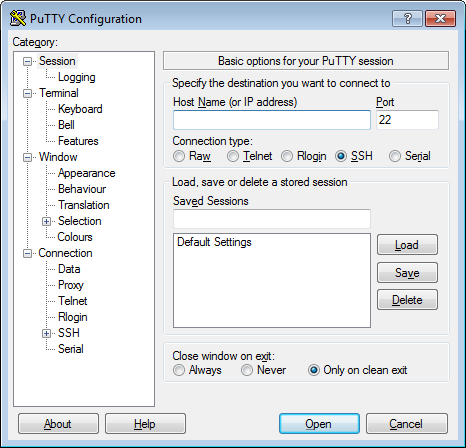
    </center>
    
2.  Complete los campos de la ventana *PuTTY Configuration* con la siguiente 
    información:

    -   **Host Name (or IP address):** 148.206.50.61

    -   **Port:** 22

    -   **Connection type:** SSH

3.  Pulse el botón *Open*:
    <center>

    
    </center>

4.  Se abrirá una nueva ventana en donde se le solicitará su nombre de usuario y 
    su contraseña:
    <center>

    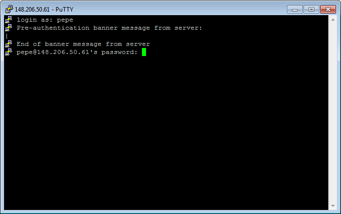
    </center>

5.  Si los datos proporcionados son correctos, se mostrará la pantalla de bienvenida 
    de Yoltla:
    <center>

    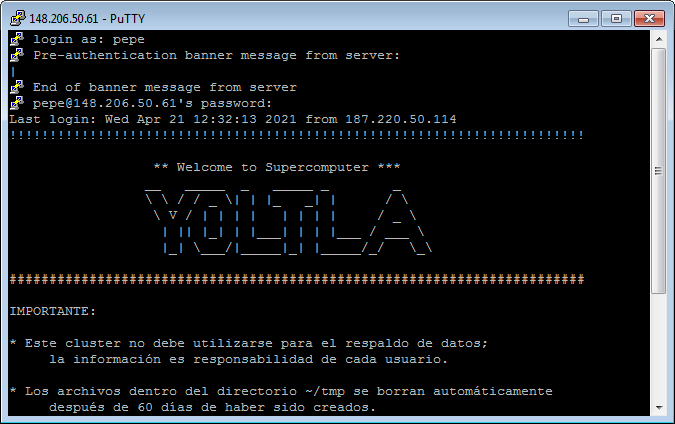
    </center>

```admonish note title="NOTA" 
Al conectarse por primera vez al clúster se le mostrará el siguiente mensaje:
<center>

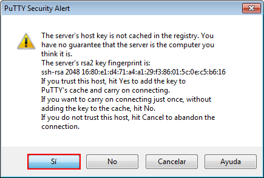
</center>

pulse el botón *Sí* para continuar.

Este mensaje es para indicarle que el servidor al que se desea conectar, necesita 
guardar un identificador en su equipo para poder tener una sesión segura.
```

**SmarTTY: Conexión al clúster Yoltla**

1.  Ejecute *SmarTTY*. Al iniciar el programa se le mostrará la siguiente 
    pantalla:
    <center>

    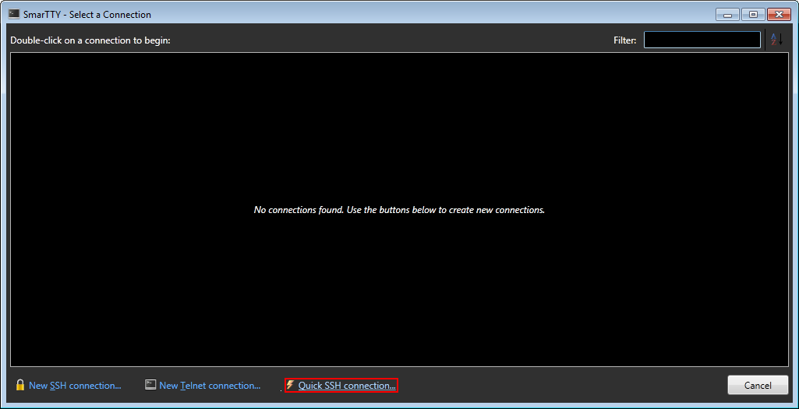
    </center>

    pulse en el texto *Quick SSH conection...*

2.  Se abrirá la siguiente ventana:
    <center>

    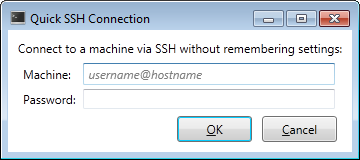
    </center>

3.  Complete los campos de la ventana *Quick SSH Conection* con la siguiente 
    información:

    -   **Machine:** \<Su nombre de usuario\>@148.206.50.61

    -   **Password:** Su contraseña

4.  Pulse el botón *OK*:
    <center>

    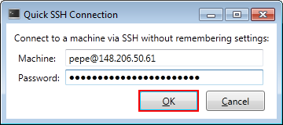
    </center>

5.  Si los datos proporcionados son correctos, se abrirá la siguiente ventana:
    <center>

    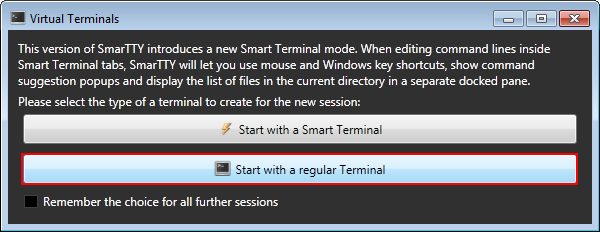
    </center>

    pulse el botón *Start with a regular Terminal*.

6.  Finalmente, se mostrará la pantalla de bienvenida de Yoltla:
    <center>

    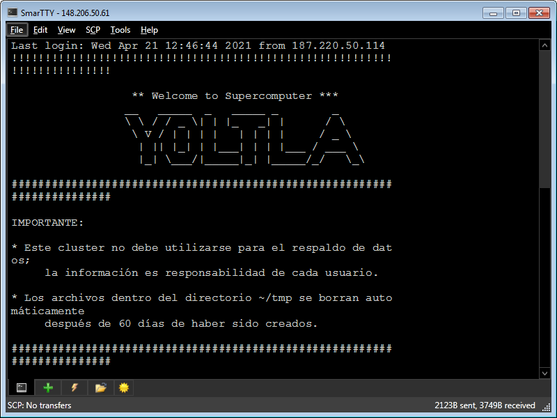
    </center>

```admonish note title="NOTA"
Al conectarse por primera vez al clúster se le mostrará el siguiente mensaje:
<center>

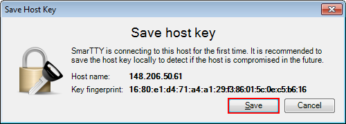
</center>

pulse el botón *Save* para continuar.

Este mensaje es para indicarle que el servidor al que se desea conectar, necesita 
guardar un identificador en su equipo para poder tener una sesión segura.
```

**Cliente SSH**

Para instalar (habilitar) el cliente SSH de este sistema, siga los siguientes pasos:

1.  Presione la tecla "Windows" para desplegar el _Menú Inicio_ y pulse en la opción _Configuración_ (se abrirá una nueva ventana):
    <center>

    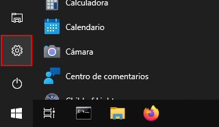
    </center>

2.  Busque la sección _Aplicaciones_ y pulse en ella:
    <center>

    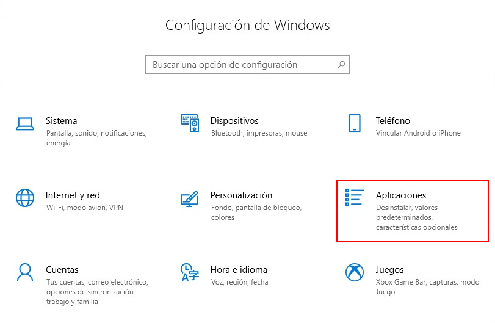
    </center>

3.  En la sección _Aplicaciones y características_, pulse en la opción _Características opcionales_:
    <center>

    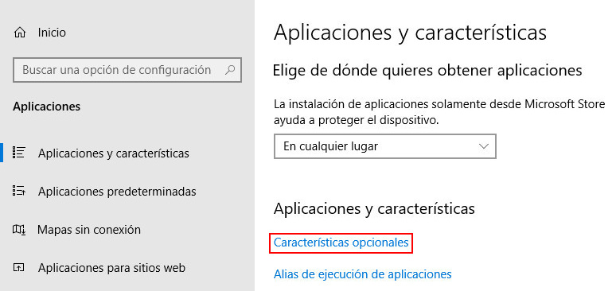
    </center>

4.  Pulse en _Agregar una nueva característica_ (se abrirá una nueva ventana):
    <center>

    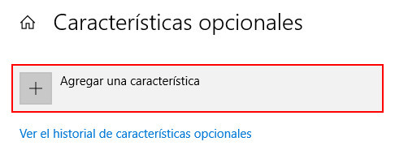
    </center>

5.  Busque la característica _Cliente de OpenSSH_, selecciónela y pulse el botón _Instalar_:
    <center>

    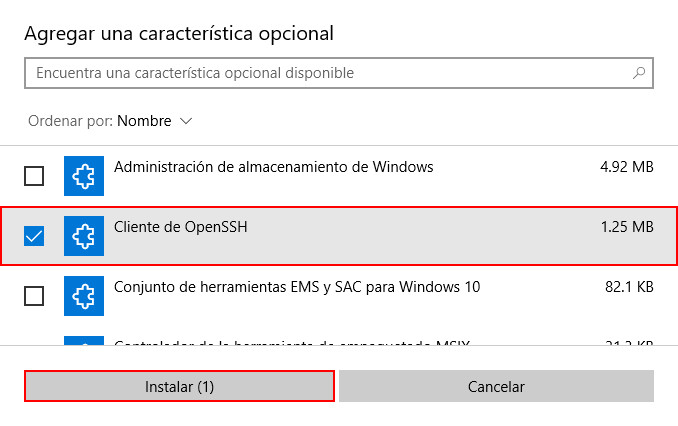
    </center>

6.  Espere a que la instalación termine:
    <center>

    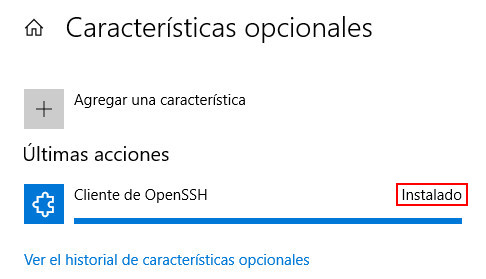
    </center>

7.  Reinicie el sistema para que los cambios se apliquen. 

**Windows PowerShell**

Para ejecutar _Windows PowerShell_, siga los siguientes pasos:

1.  Presione la tecla "Windows" para desplegar el _Menú Inicio_, busque la carpeta _Windows PowerShell_ y pulse en ella:
    <center>

    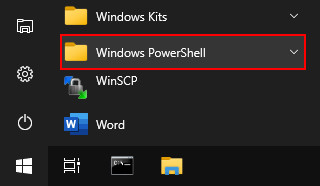
    </center>

2.  Pulse en _Windows PowerShell_:
    <center>

    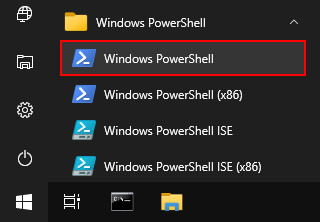
    </center>

3.  Se abrirá la siguiente ventana: 
    <center>

    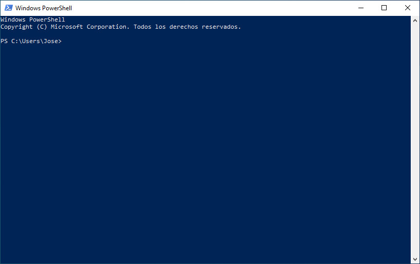
    </center>

    En esta ventana usted debe realizar la conexión al clúster.


**Ejemplo: Conexión al clúster Yoltla**

Conexión al nodo de acceso yoltla0 con el usuario pepe:
```
    PS C:\Users\Jose\> ssh -l pepe 148.206.50.61
```

Una vez que se ha establecido la conexión, el sistema le solicitará su contraseña:
```
    PS C:\Users\Jose\> ssh -l pepe 148.206.50.61

    pepe@148.206.50.61's password:
```

Si la contraseña proporcionada es correcta, se mostrará la pantalla de bienvenida de Yoltla:

    !!!!!!!!!!!!!!!!!!!!!!!!!!!!!!!!!!!!!!!!!!!!!!!!!!!!!!!!!!!!!!!!!!!!!!!!

                    ** Welcome to Supercomputer ***
                    __   _____  _   _____ _        _
                    \ \ / / _ \| | |_   _| |      / \
                     \ V / | | | |   | | | |     / _ \
                      | || |_| | |___| | | |___ / ___ \
                      |_| \___/|_____|_| |_____/_/   \_\

    ####################################################################

```admonish note title="NOTA"
La primera vez que se conecte al clúster se le mostrará el siguiente mensaje:

    PS C:\Users\Jose> ssh -l c.553 148.206.50.61
    The authenticity of host '148.206.50.61 (148.206.50.61)' can't be established.
    RSA key fingerprint is SHA256:ivxk1BSj+OaS9JGCwUoVwuDJnxlU2YWxKD34m1XPAd8.
    Are you sure you want to continue connecting (yes/no)? yes
    Warning: Permanently added '148.206.50.61' (RSA) to the list of known hosts.

Este mensaje es para indicarle que el servidor al que se desea conectar, 
necesita guardar un identificador en su equipo para poder tener una sesión segura. 
Escriba la palabra "yes" y presione la tecla "Enter" para continuar:

    Are you sure you want to continue connecting (yes/no)? yes
    Warning: Permanently added '148.206.50.61' (RSA) to the list of known hosts.
```

### Cambio de contraseña

La primera actividad a realizar cuando se conecta un nuevo usuario al clúster Yoltla es asignar
una nueva contraseña a su cuenta. Utilice el comando `passwd` para cambiar su contraseña.

Las políticas establecidas en el clúster para asignación de contraseñas son:

-   Debe estar formada por al menos 8 caracteres *(sin espacios)*
-   Debe contener un carácter minúscula *(a-z)*
-   Debe contener un carácter mayúscula *(A-Z)*
-   Debe contener un carácter numérico *(0-9)*
-   Debe contener un carácter especial *(! " # $ % & ' ( ) * + , - . / @)*

Al realizarse la primera conexión y después de establecer su nueva contraseña, la conexión se cerrará. 
Al volver a conectarse utilice su nueva contraseña.


```admonish warning title="IMPORTANTE"
La sincronización de contraseñas entre ambos nodos de acceso tomará un par de horas.
```

><center>
>
>**Ejemplo: Cambio de contraseña**
></center>
>
>Cambio de contraseña del usuario pepe:
>```
>   [pepe@yoltla0 ~]$ passwd
>```
>
>El sistema le solicitará su contraseña actual:
>```
>   [pepe@yoltla0 ~]$ passwd
>   Changing password for user pepe.
>   Changing password for pepe.
>   (current) UNIX password:
>```
>
>A continuación, si la contraseña proporcionada es correcta, el sistema le solicitará escribir 
>su nueva contraseña dos veces:
>```
>   [pepe@yoltla0 ~]$ passwd
>   Changing password for user pepe.
>   Changing password for pepe.
>   (current) UNIX password:
>   New YOLTLA password: 
>   Retype new YOLTLA password: 
>```
>
>Finalmente, si las dos contraseñas coinciden, se le mostrará el siguiente mensaje:
>```
>   passwd: all authentication tokens updated successfully.
>```

## Nodos y particiones del clúster

Los nodos (recursos de cómputo) del clúster están agrupados en particiones. Cada una de 
estas particiones tiene diferentes características, como el tiempo máximo de uso o el 
número de CPUs que pueden utilizarse. 

### Consultar las particiones del clúster

Para consultar las particiones disponibles en el clúster, utilice el siguiente comando:
```
    sinfo -o "%.10P %.6a %.11l %.6D %.5c %N"
```

A continuación se muestra de manera parcial la salida de este comando:
```
    [pepe@yoltla0 ~]$ sinfo -o "%.10P %.6a %.11l %.6D %.5c %N"
     PARTITION  AVAIL   TIMELIMIT  NODES  CPUS NODELIST
      q1h-20p*     up     1:00:00    154    20 nc[1-4,7-56,61-104,113-156,165-176]
       q1d-20p     up  1-00:00:00    154    20 nc[1-4,7-56,61-104,113-156,165-176]
       q4d-20p     up  4-00:00:00    154    20 nc[1-4,7-56,61-104,113-156,165-176]
       q7d-20p     up  7-00:00:00    154    20 nc[1-4,7-56,61-104,113-156,165-176]
       q1h-40p     up     1:00:00    154    20 nc[1-4,7-56,61-104,113-156,165-176]
             .      .           .      .     .                                   .
             .      .           .      .     .                                   .
             .      .           .      .     .                                   .
```

En la siguiente tabla se da una descripción de los campos que conforman la salida anterior:

|   **Campo**   |   **Descripción** |
|---------------|-------------------|
|   PARTITION   |   Nombre de la partición.|
|   AVAIL       |   Estado de la partición.|
|   TIMELIMIT   |   Tiempo máximo de ejecución para cualquier trabajo.|
|   NODES       |   Número de nodos en la partición.|
|   CPUS        |   Número de CPUs por nodo.|
|   NODELIST    |   Lista de nodos que conforman la partición.|

```admonish note title="NOTA"
El `*` (asterisco) que sigue al nombre de una partición, indica que es la partición 
predeterminada para el envío de trabajos.
```

Para obtener más información de este comando, consulte la página [sinfo](https://slurm.schedmd.com/sinfo.html) 
de la documentación oficial de SLURM.

### Buscar una partición disponible

Para buscar una partición disponible en el clúster, utilice la aplicación `yoltla_pool` 
del módulo *yoltla/beta*. 

Para cargar el módulo *yoltla/beta*, utilice el siguiente comando:
```
    module load yoltla/beta
```

Posteriormente, para ejecutar la aplicación `yoltla_pool`, utilice el comando:
```
    yoltla_pool
```

A continuación se da un ejemplo de la salida de este comando:
```
    [pepe@yoltla0 ~]$ module load yoltla/beta
    [pepe@yoltla0 ~]$ yoltla_pool
    Particiones por tipo de nodo:
    ===========================================
    NC         TTv1        TTv2       GPU   VGPU
    -------    ---------   ---------  ----  ------
    q1h-20p    tt2d-80p    tt2d-64p   gpus  vgpus
    q1d-20p    tt2d-100p   tt1d-128p
    q4d-20p    tt1d-160p   tt1d-256p
    q7d-20p    tt12h-320p  tt1d-512p
    q1h-40p
    q1d-40p
    q4d-40p
    q4d-80p
    q1h-80p
    q12h-80p
    q1d-80p
    q1h-160p
    q12h-160p
    q1d-160p
    q1h-320p
    q12h-320p
    q1d-320p

    Estado actual:
    =====================================
    TIPO    JOBS_PENDIENTES  NODOS_LIBRES
    ------  ---------------  ------------
    nc      44               15
    ttv1    0                4
    ttv2    1                2
    gpu     2                1
    vgpu    0                2
```

En la parte superior se muestra una tabla  con todas las particiones disponibles en el 
clúster agrupadas por tipo de nodo. Las particiones que se encuentran en la misma 
columna comparten nodos.

En la parte inferior, por tipo de nodo, se muestra una tabla con los trabajos pendientes 
y los nodos libres. Se puede observar que en algunas filas existen trabajos pendientes y 
nodos libres al mismo tiempo, existen dos razones principales para esto:

1.  Los trabajos solicitan una gran cantidad de recursos y están en espera de que estos 
    estén disponibles.

2.  Algunos usuarios han alcanzado el nivel máximo de trabajos corriendo al mismo tiempo.

```admonish note title="NOTA"
La cuota máxima de trabajos corriendo al mismo tiempo es  2,000,000 minutos de CPU por grupo.
```

En este ejemplo, las particiones con nodos tipo TTv1 no tienen ningún trabajo pendiente, 
y además, hay 4 nodos libres de este tipo, por lo que cualquier trabajo que se envíe, 
se ejecutará de manera inmediata, tomando en cuenta las restricciones antes mencionadas.

## Creación de scripts
<center>

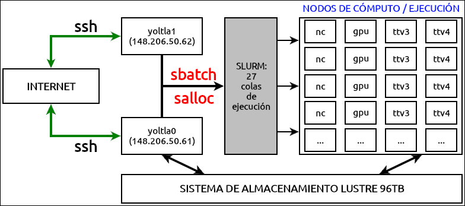
*Figura 1. Diagrama de la configuración y funcionamiento del clúster Yoltla*
</center>

Para utilizar los recursos del cluster Yoltla se debe mandar un script de SLURM.

Un script de SLURM consta de dos partes: directivas SLURM y comandos.

-   **Directivas.** Establecen las opciones con las que se va a ejecutar el trabajo. 

-   **Comandos.** Son las instrucciones necesarias para ejecutar el trabajo.
 
Las principales directivas para SLURM son:

|   **Directiva**         |   **Descripción**            |   **Uso**   |
|-------------------      |---------------------         |-------------|
|  --job-name=trabajo     |  Nombre del trabajo.         |  Opcional  |
|  --output=salida        |  Salida estándar.            |  Opcional  |
|  --error=error          |  Error estándar.             |  Opcional  |
|  --partition=partición  |  Nombre de la partición.     |  Obligatorio  |
|  --time=dd-hh:mm:ss     |  Tiempo máximo de ejecución. |  Obligatorio  |
|  --nodes=#              |  Número de nodos.            |  Obligatorio  |
|  --ntasks-per-node=#    |  Número de tareas por nodo.  |  Obligatorio  |
|  --cpus-per-task=#      |  Número de CPUs por tarea.   |  Obligatorio  |
|  --mem=#                |  Memoria por nodo.           |  Opcional     |
|  --mail-user=email      |  Correo electrónico del usuario.  |  Opcional  |
|  --mail-type=eventos    |  Eventos que se notificarán por correo electrónico.  |  Opcional  |

```admonish warning title="IMPORTANTE"
Sólo utilice la directiva:
    
        --cpus-per-task=#
    
cuando trabaje con programas de memoria compartida (OpenMP).
```


Para obtener información más detallada de cada una de estas directivas, consulte la 
sección [Directivas de SLURM](./anexos.md#directivas-de-slurm).

A continuación se presenta un ejemplo de un script:

***hola_mundo.slrm***
```
#!/bin/bash
#SBATCH --job-name=hola_mundo
#SBATCH --output=salida_%j.out
#SBATCH --error=error_%j.err
#SBATCH --partition=q1h-20p
#SBATCH --time=0-00:00:10
#SBATCH --nodes=1
#SBATCH --ntasks-per-node=20
#SBATCH --mail-user=pepe@host.com
#SBATCH --mail-type=all

srun echo "Hola Mundo!"
```

Si desea ver más ejemplos, consulte la sección [Scripts de ejemplo](./anexos.md#scripts-de-ejemplo).

## Envío y administración de trabajos

### Enviar un trabajo

Para enviar un trabajo, utilice el comando `sbatch` seguido del nombre de su script:
```
    sbatch <nombre del script>
```

Por ejemplo, para enviar el script _hola_mundo.slrm_, ejecute el comando:
```
    [pepe@yoltla0 ~]$ sbatch hola_mundo.slrm 
    Submitted batch job 787047
```

Cada trabajo tiene un identificar único, este identificador le permite consultar, actualizar 
o cancelar el trabajo. En este ejemplo, el número _787047_ es el identificador del trabajo.

Para obtener más información de este comando, consulte la página [sbatch](https://slurm.schedmd.com/sbatch.html) 
de la documentación oficial de SLURM.

### Consultar un trabajo

Para consultar un trabajo en el clúster, utilice el comando `squeue` seguido de la opción 
`-j` y el ID de su trabajo:
```
    squeue -j <ID del trabajo>
```

```admonish tip title="TIP"
Para consultar varios trabajos con un solo comando, use el formato:

    squeue -j <ID del trabajo 1>,<ID del trabajo 2>,<ID del trabajo 3>,....
```

```admonish tip title="TIP"
Para consultar todos sus trabajos, utilice el comando `squeue` seguido de la opción
 `-u` y su nombre de usuario:

    squeue -u <nombre de usuario>
```

Por ejemplo, para consultar el trabajo con ID 786836, ejecute el comando:
```
[pepe@yoltla0 ~]$ squeue -j 786836
            JOBID PARTITION     NAME     USER ST       TIME  NODES NODELIST(REASON)
            786836   q1h-20p ley_coul     pepe PD       0:00      1 (Resources)
```

En la siguiente tabla se da una descripción de los campos que conforman la salida anterior:

|   **Campo**   |   **Descripción**     |
|---------------|-----------------------|
|   JOBID       |   ID del trabajo.     |
|   PARTITION   |   Partición asignada al trabajo.  |
|   NAME        |   Nombre del trabajo. |
|   USER        |   Nombre del usuario que envió el trabajo.  |
|   ST          |   Estado del trabajo (ver sección [Job State Codes](./anexos.md#job-state-codes)). |
|   TIME        |   Tiempo de ejecución del trabajo.  |
|   NODES       |   Número de nodos asignados al trabajo.  |
|   NODELIST(REASON)  | Razón por la que el trabajo está esperando su ejecución(ver sección [Job Reason Codes](./anexos.md#job-reason-codes)).<br>Nodos en que se ejecuta el trabajo.  |

```admonish note title="NOTA"
Si ejecuta el comando `squeue` sin ninguna opción, se mostrarán todos los trabajos 
que se encuentran actualmente en el clúster:

    [pepe@yoltla0 ~]$ squeue
        JOBID PARTITION     NAME     USER ST       TIME  NODES NODELIST(REASON)
        752085 tt1d-128p simulaci   c.3925  R   18:56:03      4 tt[95-98]
        783540   q1d-20p  energia   c.8417  R      50:09      1 nc18
        783055  q12h-80p fisica_c   c.5553  R    5:37:45      4 nc[69,131,133-134]
        783545   q4d-40p biologia   c.6547 PD       0:00      2 (Resources)
            .         .        .        .  .          .      .                  .    
            .         .        .        .  .          .      .                  .    
            .         .        .        .  .          .      .                  .    
```

Para obtener más información de este comando, consulte la página [squeue](https://slurm.schedmd.com/squeue.html) 
de la documentación oficial de SLURM.

### Cancelar un trabajo

Para cancelar un trabajo, utilice el comando `scancel` seguido del ID del trabajo:
```
    scancel <ID del trabajo>
```
Al utilizar el comando `scancel` no obtendrá ningún mensaje por parte del sistema.

```admonish tip title="TIP"
Para cancelar varios trabajos con un solo comando, use el formato:
    
    scancel <ID del trabajo 1>,<ID del trabajo 2>,<ID del trabajo 3>,...
```

Por ejemplo, para cancelar el trabajo con ID 786836, ejecute el comando:
```
    [pepe@yoltla0 ~]$ scancel 786836
```

```admonish note title="NOTA"
Solo el usuario propietario del trabajo puede cancelarlo.
```

Para obtener más información de este comando, consulte la página [scancel](https://slurm.schedmd.com/scancel.html) 
de la documentación oficial de SLURM.

## Monitoreo de trabajos

Puede monitorear un trabajo conectándose al nodo en el que se está ejecutando y utilizando 
la aplicación htop.

### Consultar el nodo de ejecución

Para consultar en que nodo se está ejecutando un trabajo utilice el comando `squeue` 
(ver sección [Consultar un trabajo](#consultar-un-trabajo)) o el comando `sacct` (ver sección 
[Historial de trabajos](#historial-de-trabajos)).

Por ejemplo, para consultar en que nodo se está ejecutando el trabajo con ID 817543, 
ejecute el comando:
```
    [pepe@yoltla0 ~]$  squeue -j 817543
             JOBID PARTITION     NAME     USER ST       TIME  NODES NODELIST(REASON)
            817543   q1h-20p script_g     pepe  R      10:15      1 nc87
```

En este caso, el trabajo con ID 817543 se está ejecutando en el nodo nc87.

```admonish note title="NOTA"
Si un trabajo utiliza MPI, es posible que se esté ejecutando en varios nodos. 
```

### Conectarse a un nodo

Para conectarse a un nodo, utilice el comando `ssh` seguido del nombre del nodo:
```
    ssh <nombre del nodo>
```

```admonish note title="NOTA"
Solo podrá conectarse a un nodo, si en él se esta ejecutando alguno de sus trabajos. 
Una vez que el trabajo haya concluido la conexión terminará.
```

Por ejemplo, para conectarse al nodo nc87, ejecute el comando:
```
[pepe@yoltla0 ~]$ ssh nc87
Warning: Permanently added 'nc87,10.10.200.87' (RSA) to the list of known hosts.
[pepe@nc87 ~]$ 
```

```admonish note title="NOTA"
Es posible que en algunos casos se le solicite su contraseña para tener acceso al nodo.
```

### Monitorear un trabajo

Para monitorear un trabajo, utilice el comando `htop` seguido de la opción `-u` y su 
nombre de usuario:
```
    htop -u <nombre de usuario>
```

```admonish note title="NOTA"
Recuerde que debe estar conectado al nodo en que se está ejecutando su trabajo.
```

Por ejemplo, para el usuario pepe, el comando correspondiente es el siguiente:
```
    [pepe@nc87 ~]$ htop -u pepe
```

Después de ejecutar este comando, el aspecto de la terminal cambiará al que se muestra 
a continuación:
<center>

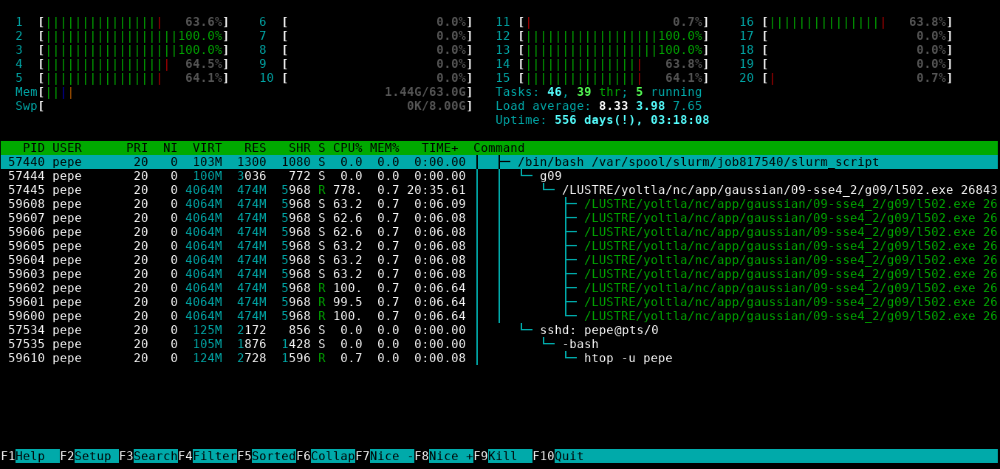
</center>

Desde esta interfaz puede monitorear el uso de CPU, el uso de memoria RAM y el tiempo 
que se ha estado ejecutando su trabajo. Presione la tecla `q` para salir. 


Para obtener más información del uso de la aplicación htop consulte la sección [htop](#htop).

```admonish note title="NOTA"
Si el comportamiento de su trabajo no es el esperado, puede cancelar el trabajo utilizando el 
comando `scancel` (ver sección [Cancelar un trabajo](#cancelar-un-trabajo)).

Si necesita soporte adicional, envíe un correo a <soporte.lsvp@gmail.com>.
```

### Desconectarse de un nodo

Para desconectarse de un nodo, ejecute el comando:
```
    exit
```

En nuestro ejemplo, al desconectarnos del nodo nc87, obtenemos la siguiente salida:
```
[pepe@nc87 ~]$ exit
logout
Connection to nc87 closed.
[pepe@yoltla0 ~]$
```

## Historial de trabajos

### Consultar el historial de trabajos

Para consultar su historial de trabajos, utilice el siguiente comando:
```
    sacct
```

A continuación se muestra un ejemplo de la salida del comando `sacct`:
```
    [pepe@yoltla0 ~]$ sacct
        JobID    JobName  Partition    Account  AllocCPUS      State ExitCode
    ------------ ---------- ---------- ---------- ---------- ---------- --------
    817539       prueba_ga+    q1d-20p       pepe         20     FAILED      1:0 
    817539.batch      batch                  pepe         20     FAILED      1:0
    817540       prueba_ga+    q1d-20p       pepe         20     FAILED      1:0 
    817540.batch      batch                  pepe         20     FAILED      1:0
    817543       script_ga+    q1h-20p       pepe         20    RUNNING      0:0 

```

En la siguiente tabla se da una descripción de los campos que conforman la salida anterior:


|   Campo     |   Descripción  |
|-------------|----------------|
|   JobID     | Número de identificación del trabajo. |
|   JobName   | Nombre del trabajo.            |
|   Partition | Partición asignada al trabajo. |
|   Account   | Nombre de la cuenta bajo la que se ejecutó el trabajo.|
|   AllocCPUS | Número de CPUs asignados al trabajo.|
|   State     | Estado del trabajo.            |
|   ExitCode  | Código de salida del trabajo.  |

```admonish tip title="TIP"
Puede utilizar la opción `-X` para que solo se muestren las estadísticas relevantes 
de sus trabajos, sin tomar en consideración los pasos de los mismos:

    [pepe@yoltla0 ~]$ sacct -X
        JobID    JobName  Partition    Account  AllocCPUS      State ExitCode
    ------------ ---------- ---------- ---------- ---------- ---------- --------
    817539       prueba_ga+    q1d-20p       pepe         20     FAILED      1:0 
    817540       prueba_ga+    q1d-20p       pepe         20     FAILED      1:0 
    817543       script_ga+    q1h-20p       pepe         20    RUNNING      0:0 
```

### Filtrar el historial de trabajos

Por defecto, al ejecutar el comando `sacct` solo se mostrarán sus
trabajos del día actual, sin embargo, puede utilizar diferentes opciones
con este comando para poder filtrar su historial de trabajos:

|   Opción                   |      Descripción             |
|----------------------------|------------------------------|   
| --jobs=\<lista de IDs>     | Muestra todos los trabajos cuyo ID coincida con alguno de los indicados en la lista. |
| --name=<lista de nombres>  | Muestra todos los trabajos cuyo nombre coincida con alguno de los indicados en la lista. |
| --state=<lista de estados> |  Muestra todos los trabajos cuyo estado coincida con alguno de los indicados en la lista (ver sección [Job State Codes](./anexos.md#job-state-codes)). |
| --partition=<lista de particiones> | Muestra todos los trabajos cuya partición coincida con alguna de las indicadas en la lista (ver sección [Recursos de cómputo](./anexos.md#recursos-de-cómputo)). |
| --starttime=AAAA-MM-DD     | Muestra todos los trabajos que fueron enviados a partir de la fecha indicada. |
| --endtime=AAAA-MM-DD       | Muestra todos los trabajos que fueron enviados antes de la fecha indicada. |

Por ejemplo, para consultar todos los trabajos cuyo nombre sea
*simulacion*, tengan el estado *COMPLETED* o *FAILED*, y hayan sido
enviados entre el *01/04/2021* y el *01/05/2021*, ejecute el comando:
```
[pepe@yoltla0 ~]$ sacct -X --name=simulacion --state=COMPLETED,FAILED --starttime=2021-04-01 --endtime=2021-05-01
        JobID    JobName  Partition    Account  AllocCPUS      State ExitCode
------------ ---------- ---------- ---------- ---------- ---------- --------
776552       simulacion    q1h-20p       pepe         20     FAILED      2:0
787047       simulacion    q1h-20p       pepe         20  COMPLETED      0:0
790569       simulacion    q1h-20p       pepe         20  COMPLETED      0:0
```

### Dar formato al historial de trabajos

Además de poder filtrar su historial de trabajos, también puede indicar el formato en 
que se muestra esta información. Utilice la opción `--format` para indicar que campos 
(ver sección [Job Accounting Fields](./anexos.md#job-accounting-fields)) desea 
que se desplieguen en la salida del comando `sacct`:
```
    sacct --format=<lista de campos>
```

```admonish tip title="TIP"
Puede imprimir la lista de todos los campos que se pueden especificar en la opción 
`--format`, utilizando el comando `sacct` seguido de la opción `-e`:

       sacct -e
```

Por ejemplo, para consultar los campos *JobID*, *JobName*, *State* y *NodeList*, de todos 
sus trabajos del día actual, que se encuentran en estado *RUNNING*, ejecute el comando:

```
[pepe@yoltla0 ~]$  sacct -X --format=JobID,JobName,State,NodeList --state=RUNNING
    JobID    JobName      State        NodeList
------------ ---------- ---------- ---------------
817543       script_ga+    RUNNING            nc87
```

Para obtener más información de este comando, consulte la página [sacct](https://slurm.schedmd.com/sacct.html) 
de la documentación oficial de SLURM.

## Eficiencia de trabajos

### Consultar el informe de eficiencia

Puede consultar el informe de eficiencia de un trabajo con el comando `seff` seguido 
del ID del trabajo:
```
    seff <ID del trabajo>
```

```admonish note title="NOTA"
No se recomienda el uso del comando `seff` en trabajos fallidos o en ejecución, ya 
que puede reportar información errónea.
```

Por ejemplo, para consultar el informe de eficiencia del trabajo con ID 888872, 
ejecute el comando:
```
[pepe@yoltla0 ~]$ seff 888872
Job ID: 888872
Cluster: yoltla
User/Group: c.553/edra
State: COMPLETED (exit code 0)
Nodes: 1
Cores per node: 20
CPU Utilized: 05:53:51
CPU Efficiency: 99.96% of 05:54:00 core-walltime
Job Wall-clock time: 00:17:42
Memory Utilized: 53.33 GB
Memory Efficiency: 88.89% of 60.00 GB
```
A continuación se da una breve explicación de algunos de los campos de la salida anterior:

-   El tiempo de CPU (*core-walltime*) es la cantidad de tiempo que la CPU dedicó al 
    trabajo. Por ejemplo, si un trabajo se ejecutó durante una 1 hora en 20 CPUs, 
    entonces habrá usado 20 horas de CPU.

-   La eficiencia de CPU (*CPU Efficiency*) es la relación del tiempo de CPU utilizado 
    (*CPU Utilized*) y el tiempo de CPU.

-   La eficiencia de memoria (*Memory Efficiency*) es la relación de la cantidad de 
    memoria utilizada (*Memory Utilized*) y la cantidad de memoria solicitada.

En este este ejemplo, el trabajo se ejecutó durante 17 minutos y 42 segundos en 20 CPUs, 
por lo que su tiempo de CPU es de 5 horas con 54 minutos, pero el tiempo de CPU utilizado 
es de 5 horas con 53 minutos y 51 segundos, por lo tanto, la eficiencia de CPU es del 99.96%. 
La cantidad de memoria solicitada fue de 60.00 GB, pero la cantidad de memoria utilizada 
fue de 53.33 GB, por lo tanto, la eficiencia de memoria es del 88.89%.

```admonish warning title="IMPORTANTE"
Para obtener el informe de la eficiencia de la memoria es necesario utilizar la directiva:

        --mem=#

en su script de SLURM, de lo contrario el valor reportado será el siguiente:

        Memory Efficiency: 0.00% of 0.00 MB (0.00 MB/node)
```

## Aplicaciones del clúster

Las aplicaciones en el clúster Yoltla están disponibles mediante la herramienta *Modules*. 
Esta herramienta permite crear, modificar y agregar valores a las variables de entorno 
necesarias para el funcionamiento de las aplicaciones instaladas en Yoltla, además facilita 
la ejecución, compilación y uso de múltiples versiones de aplicaciones.

### Listar los módulos del clúster

Para listar los módulos del clúster, utilice el comando `module` seguido del subcomando `avail`:
```
    module avail
```
A continuación se muestra de manera parcial la salida de este comando:
```
[pepe@yoltla0 ~]$ module avail
----------------------------- /LUSTRE/yoltla/nc/mf -----------------------------
compilers/gcc/5.4.0
compilers/intel/2013/u1/xe-13.2.144
.
.
.
tools/tmux/2.0
tools/vmd/1.9.2

---------------------------- /LUSTRE/yoltla/gpu/mf -----------------------------
compilers/cuda/5.0
compilers/cuda/5.5
.
.
.
cuda/7.5/intel/15.2.164/impi/5.0.3.48/gromacs/5.0.7-s
cuda/7.5/intel/15.6.232/impi/5.0.3.49/gromacs/5.1.4-s

--------------------------- /LUSTRE/yoltla/modules/ ----------------------------
abinit/8.4.1                 namd/2.13
amber/ambertools19           namd/2.13-CUDA
.                            .
.                            .
.                            .
namd/2.12-CUDA               wien2k/19.1
namd/2.12-GIT-CUDA           xtb/6.2.3
```

```admonish warning title="IMPORTANTE"
Para hacer uso de los módulos del clúster es necesario cargarlos.
```

### Cargar un módulo

Para cargar un módulo, utilice el comando `module` seguido del subcomando `load` y el 
nombre del módulo a cargar:
```
    module load <módulo>
```

Al utilizar este comando no obtendrá ningún mensaje por parte del sistema.

Por ejemplo, para cargar el modulo *intel/impi-2017u4*, ejecute el comando:
```
    [pepe@yoltla0 ~]$ module load intel/impi-2017u4
```

```admonish note title="NOTA"
Los módulos sólo se cargan en la sesión actual del usuario.
```

```admonish warning title="IMPORTANTE"
Si intenta cargar un módulo que no es compatible con alguno de los módulos cargados 
actualmente, el sistema le mostrará un mensaje de error:

    [pepe@yoltla ~]$ module load openmpi/3.1.4
    openmpi/3.1.4(19):ERROR:150: Module 'openmpi/3.1.4' conflicts with the currently loaded module(s) 'intel/impi-2017u4'
    openmpi/3.1.4(19):ERROR:102: Tcl command execution failed: conflict        intel/impi-2017u4

Para solucionar este problema, primero descargue el módulo que causa el error, y 
posteriormente cargue el nuevo módulo:

    [pepe@yoltla ~]$ module unload intel/impi-2017u4
    [pepe@yoltla ~]$ module load openmpi/3.1.4

```

### Listar los módulos cargados

Para listar todos los módulos cargados, utilice el comando `module` seguido del subcomando `list`:
```
    module list
```
Por ejemplo, el usuario pepe tiene cargados los siguientes módulos:
```
[pepe@yoltla0 ~]$ module list
Currently Loaded Modulefiles:
  1) /intel/compilers-2017u4
  2) /python/intel/2.7
  3) /singularity/evolinc-i/5.0
```

```admonish note title="NOTA"
En caso de no tener módulos cargados obtendrá el siguiente mensaje por parte del sistema:

        No Modulefiles Currently Loaded.
```

### Descargar un módulo

Para descarga un módulo, utilice el comando `module` seguido del subcomando `unload` y 
el nombre del módulo a descargar:
```
    module unload <módulo>
```
Al utilizar este comando no obtendrá ningún mensaje por parte del sistema.

Por ejemplo, para descargar el módulo *intel/impi-2017u4*, ejecute el comando:
```
    [pepe@yoltla0 ~]$ module unload intel/impi-2017u4
```

### Descargar todos los módulos cargados

Para descargar todos los módulos cargados, utilice el comando `module` seguido del 
subcomando `purge`:
```
    module purge
```

Al utilizar este comando no obtendrá ningún mensaje por parte del sistema.

Por ejemplo, el usuario pepe tiene cargados los siguientes módulos:
```
[pepe@yoltla0 ~]$ module list
Currently Loaded Modulefiles:
  1) /intel/compilers-2017u4
  2) /python/intel/2.7
  3) /singularity/evolinc-i/5.0
```

Al ejecutar el comando:
```
    [pepe@yoltla0 ~]$ module purge
```

Y volver a comprobar los módulos cargados, se obtiene el siguiente mensaje:
```
[pepe@yoltla0 ~]$ module list
No Modulefiles Currently Loaded.
```

## Multiplexor de terminales (tmux)

Tmux es un programa para terminal que permite dividir una consola en múltiples secciones. 
Es útil para realizar muchas tareas al mismo tiempo sin tener que crear mas de una conexión.

### Cargar la aplicación

Para utilizar `tmux` es necesario cargar su módulo correspondiente. 
Utilice el comando:
```
    module load tools/tmux/2.0
```

para cargar la aplicación tmux.

### Crear una sesión

Para crear una sesión en tmux, utilice el siguiente comando:
```
    tmux new-session
```

El aspecto de la terminal cambiará al siguiente:
<center>

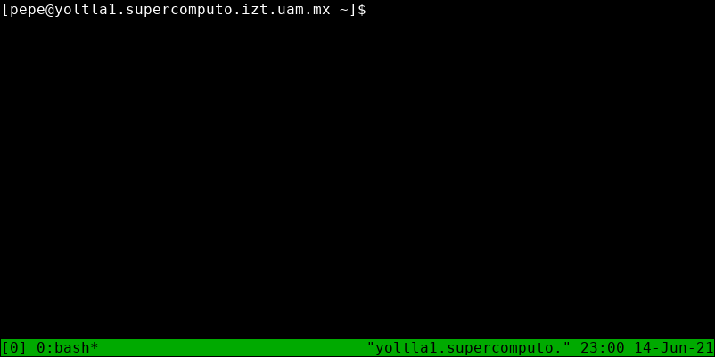
</center>

En la parte inferior de la terminal se añadirá una barra de color verde, llamada línea 
de estado. En la línea de estado se muestran los siguientes elementos:

-   A la izquierda, el nombre de la sesión.

-   En el centro, una lista de las ventanas de la sesión, con su índice.

-   A la derecha, el título del panel entre comillas (por defecto es el
    nombre del anfitrión que ejecuta tmux) y, la hora y la fecha.

```admonish note title="NOTA"
De forma predeterminada, tmux le asigna un nombre a cada sesión, la primera sesión se 
llamará *0*, la segunda *1* y así sucesivamente. Puede especificar un nombre para la 
sesión utilizando la opción `-s`:

        tmux new-session -s <nombre de la sesión>
```

### Crear una ventana

Por defecto, al crear una sesión en tmux, se crea una sola ventana, sin embargo, puede 
crear múltiples ventanas en una misma sesión.

Para crear una nueva ventana, presione las teclas `Ctrl + b`, y después presione la tecla `c`:
<center>

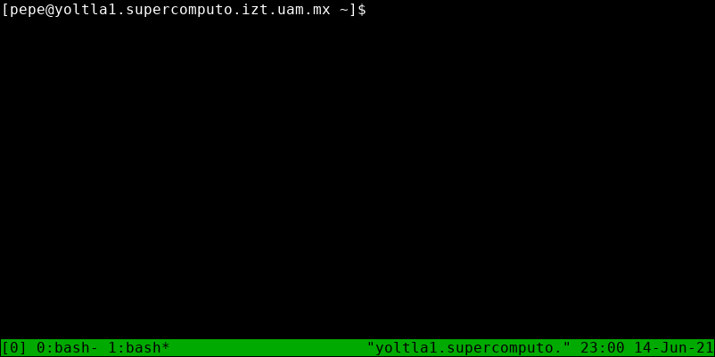
</center>

La nueva ventana se convertirá en la ventana activa.

```admonish note title="NOTA"
En la línea de estado, un `*` (asterisco) junto al nombre de la ventana indica que 
es la ventana activa.
```

### Navegar entre ventanas

Para navegar entre las diferentes ventanas de una sesión de tmux, presione las teclas 
`Ctrl + b`, y después presione la tecla correspondiente al índice de la ventana.

Por ejemplo, en la siguiente sesión se tienen 3 ventanas:
<center>


</center>

Para cambiar a la ventana 2, presione las teclas `Ctrl + b`, y después
presione la tecla `2`.
<center>

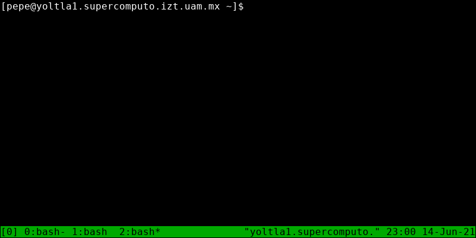
</center>

### Crear un panel

Además de poder crear múltiples ventanas en una sesión de tmux, es posible dividir una 
ventana para crear múltiples paneles. Una ventana se puede divir de manera horizontal 
o vertical.

Para dividir una ventana horizontalmente, presione las teclas `Ctrl + b`, y después 
presione la tecla `%` (porcentaje):
<center>

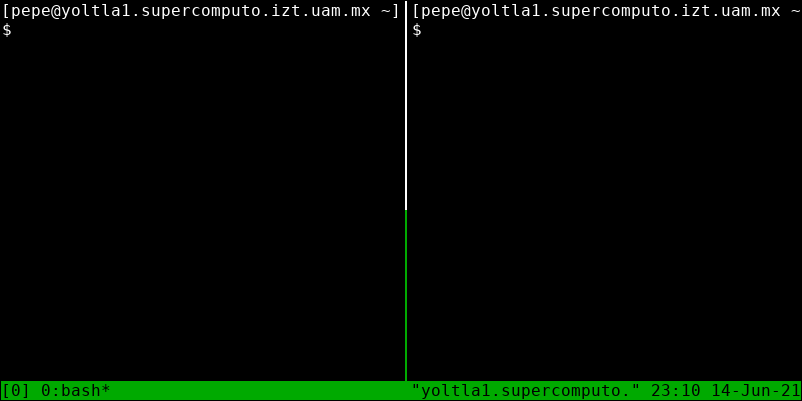
</center>

El nuevo panel se convertirá en el panel activo.

Para dividir una ventana verticalmente, presione las teclas `Ctrl + b`, y después presione 
la tecla `"` (comillas dobles):
<center>

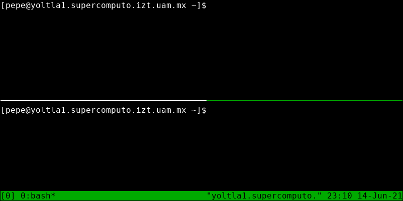
</center>

El nuevo panel se convertirá en el panel activo.

```admonish note title="NOTA"
Un borde de color verde indica el panel activo.
```

### Navegar entre panales

Para navegar entre los diferentes paneles de una ventana, presione las teclas `Ctrl + b`, 
y después presione alguna de las teclas de dirección.

Por ejemplo, la siguiente ventana se encuentra divida en cuatro paneles:
<center>

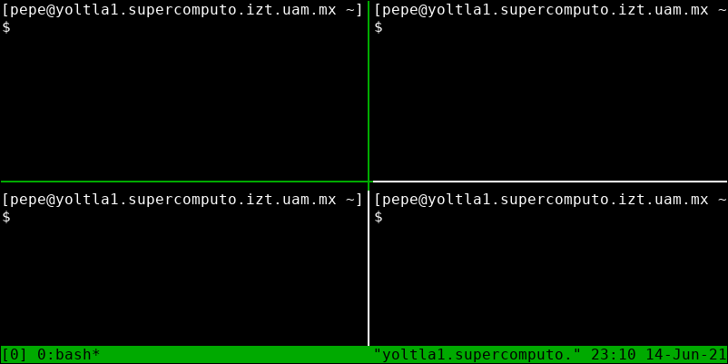
</center>

Para navegar desde el panel superior izquierdo al panel inferior derecho, siga los 
siguientes pasos:

1.  Presione las teclas `Ctrl + b`, y después presione la tecla `→`
    (derecha).

2.  Presione las teclas `Ctrl + b`, y después presione la tecla `↓`
    (abajo).
<center>

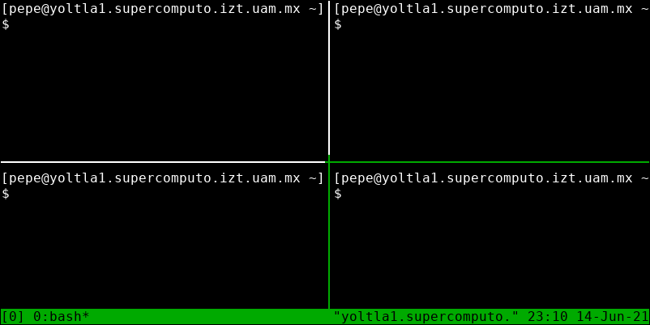
</center>

### Eliminar un panel/ventana

Para eliminar un panel/ventana de una sesión de tmux, primero navegue al panel/ventana 
que desea eliminar y después presione las teclas `Ctrl + d`.

```admonish note title="NOTA"
Si la sesión solo cuenta con una ventana y esta es eliminada, la sesión se terminará.
```

### Desconectarse de una sesión

Para desconectarse de una sesión, presione las teclas `Ctrl + b`, y después presione la tecla `d`.

Al desconectarse de una sesión, regresará a la terminal y se imprimirá un mensaje con el nombre 
de la sesión, la sesión de tmux y cualquier programa dentro de ella seguirá ejecutándose en 
segundo plano.

Por ejemplo, al desconectarse de la sesión con nombre *aplicaciones*, se muestra el siguiente mensaje:
```
[pepe@yoltla0 ~]$ tmux new-session -s aplicaciones
[detached (from session aplicaciones)]
```

### Conectarse a una sesión

Para conectarse a una sesión, utilice el siguiente comando:
```
    tmux attach -t <nombre de la sesión>
```

Por ejemplo, para conectarse a la sesión *aplicaciones*, ejecute el comando:
```
    [pepe@yoltla0 ~]$ tmux attach -t aplicaciones
```

### Listar las sesiones

Para obtener un listado de todas las sesiones disponibles, utilice el comando:
```
    tmux ls
```
Por ejemplo, el usuario pepe tiene las siguientes sesiones disponibles:
```
[pepe@yoltla0 ~]$ tmux ls
prueba: 2 windows (created Mon Jun 5 16:15:12 2021)
aplicaciones: 5 windows (created Mon Jun 5 16:30:03 2021)
simulacion: 3 windows (created Mon Jun 8 18:00:06 2021)
```

### Eliminar una sesión

Para eliminar una sesión, utilice el comando:
```
    tmux kill-session -t <nombre de la sesión>
```

Por ejemplo, para eliminar la sesión *prueba*, ejecute el comando:
```
    [pepe@yoltla0 ~]$ tmux kill-session prueba
```

Al utilizar este comando no obtendrá ningún mensaje por parte del sistema.

Para obtener más información de la aplicación tmux, consulte la página 
[Getting Started](https://github.com/tmux/tmux/wiki/Getting-Started) de 
la wiki oficial de tmux.

## htop

htop es un visor de procesos interactivo.

### Iniciar la aplicación

Para iniciar la aplicación htop, utilice el comando `htop` seguido de la opción `-u` y 
su nombre de usuario:
``` bash
    htop -u <nombre de usuario>
```

```admonish note title="NOTA"
Si ejecuta el comando `htop` sin ninguna opción, se mostrarán los procesos de todos 
los usuarios del sistema.
```

El aspecto de la terminal cambiará al siguiente:
<center>


</center>

La interfaz de htop se divide en tres secciones:

-   **Cabecera.** Muestra información sobre el uso de CPU, memoria RAM y memoria SWAP, 
    el número de procesos activos (Tasks), la carga media (Load average) y el tiempo 
    de actividad del sistema (Uptime).

-   **Tabla de procesos.** Lista todos los procesos activos en el sistema.

-   **Pie de página.** Atajos de teclado para comandos de htop.

### Cabecera

En esta sección se encuentra resumen de los recursos del sistema y de su uso.
<center>

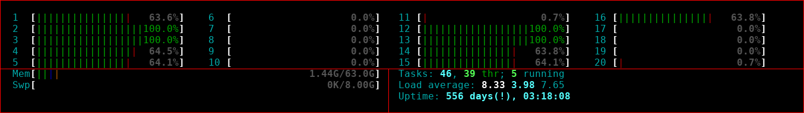
</center>

A continuación se da una descripción de los elementos que conforman esta sección:

-   En la parte superior se encuentran varias barras numeradas del 1 al n, las cuales 
    representan las CPUs del sistema y su carga.

-   En la parte inferior izquierda se encuentran dos barras con las palabras `Mem` y `Swp`, 
    las cuales representan, respectivamente, el uso de memoria RAM y SWAP en el sistema.

-   En la parte inferior derecha se encuentran los siguientes elementos:

    -   **Tasks.** Número de procesos activos en el sistema. Hay tres valores asociados 
        a este elemento: el primero representa el número total de procesos, el segundo 
        el número de subprocesos y el tercero el número de procesos en ejecución.

    -   **Load average.** Carga media del sistema. Hay tres números asociados a este 
        elemento: el primero representa la carga media del último minuto, el segundo 
        la carga media de los últimos cinco minutos y el tercero la carga media de los 
        últimos quinceminutos.

    -   **Uptime.** Tiempo de actividad del sistema desde su último reinicio.

```admonish note title="NOTA"
El uso de la memoria SWAP debe ser 0. Si su aplicación está utilizando memoria SWAP, 
se comportará de manera muy lenta.
```

```admonish note title="NOTA"
En general, la carga media debe ser igual al número de CPUs en el sistema. En este 
ejemplo, la carga media debe ser 20.
```

### Tabla de procesos

En esta sección se listan todos los procesos activos en el sistema.
<center>

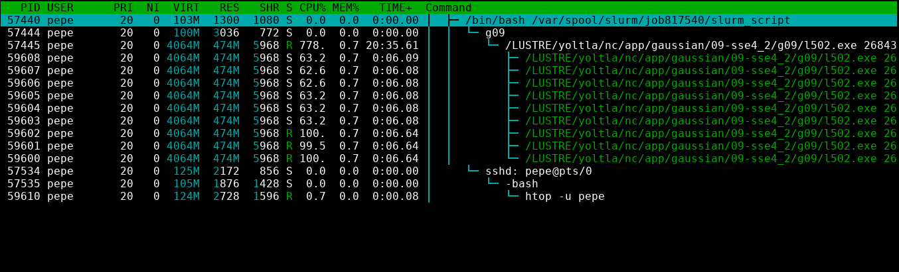
</center>

```admonish note title="NOTA"
Puede desplazarse por la tabla de procesos utilizando las flechas de dirección o 
el ratón. Una barra de color azul resalta el proceso seleccionado actualmente.
```

A continuación se da una descripción de las columnas que conforman esta tabla:

|   **Columna**     |   **Descripción**                             |
|-------------------|-----------------------------------------------|
|   PID             | Número de identificación del proceso.         |
|   USER            | Nombre del usuario propietario del proceso    |
|   PRI             | Prioridad del proceso en el kernel.           |
|   NI              | Prioridad (valor nice) del proceso.           |
|   VIRT            | Memoria virtual que consume el proceso.       |
|   RES             | Memoria física que consume el proceso.        |
|   SHR             | Memoria compartida que consume el proceso.    |
|   S               | Estado del proceso.                           |
|   CPU%            | Porcentaje de CPU que consume el proceso.     |
|   MEM%            | Porcentaje de memoria que consume el proceso. |
|   TIME+           | Tiempo, medido en tics de reloj, desde que se inició la ejecución del proceso. |
|   Command         | Nombre del comando que inició el proceso.     |

### Pie de página

En esta sección se encuentran atajos de teclado para algunos comandos de htop.
<center>


</center>

A continuación se da una descripción de cada uno de los atajos:


|   **Atajo**   |   **Descripción**                     |
|---------------|---------------------------------------|
|   F1          | Ir a la pantalla de ayuda.            |
|   F2          | Ir a la pantalla de configuración.    |
|   F3          | Buscar un proceso por nombre.         |
|   F4          | Filtrar los procesos utilizando una palabra clave. |
|   F5          | Activar/desactivar la vista de árbol. |
|   F6          | Ordenar los procesos por columna.     |
|   F7          | Aumentar la prioridad (valor nice) del proceso seleccionado. |
|   F8          | Disminuir la prioridad (valor nice ) del proceso seleccionado. |
|   F9          | Matar el proceso seleccionado.        |
|   F10         | Salir de htop.                        |

```admonish note title="NOTA"
En la vista de árbol se muestra la relación de cada proceso del sistema 
y sus subprocesos. 
```

Para obtener más información de la aplicación htop, consulte su 
[página oficial](https://htop.dev/).

## Transferencia y respaldo de información

```admonish warning title="IMPORTANTE"
La transferencia y respaldo de información debe realizarse por medio del nodo de 
acceso `yoltla1` (148.206.50.62).
```

### GNU/Linux

**Transferencia de onformación**

Para transferir información del equipo local al clúster, utilice el comando `scp` 
siguiendo el formato que se muestra a continuación:
```
scp -Crp <origen del archivo/directorio> <nombre de usuario>@<dirección IP del nodo de acceso>:<destino del archivo/directorio>
```

Otra forma, mas confiable, de transferir información al clúster es utilizando el 
comando `rsync`:
```
rsync -Paz <origen del archivo/directorio> <nombre de usuario>@<dirección IP del nodo de acceso>:<destino del archivo/directorio>
```

><center>
>
>**Ejemplo: Tranferencia de un directorio al clúster**
></center>
>
>En el siguiente ejemplo se copia el directorio *simulacion*, ubicado en el directorio 
>actual del usuario jose, al directorio *programas*, ubicado en el directorio *home* 
>del usuario pepe:
>```
>[jose@mi_PC Documentos]$ scp -Crp simulacion pepe@148.206.50.62:programas
>```        
>
>Una vez que se ha establecido la conexión, el sistema le solicitará su contraseña:
>```
>[jose@mi_PC Documentos]$ scp -Crp simulacion pepe@148.206.50.62:programas
>
>pepe@148.206.50.62's password:
>```
>
>Si la contraseña proporcionada es correcta, la transferencia comenzará:
>```
>[jose@mi_PC Documentos]$ scp -Crp simulacion pepe@148.206.50.62:programas
>
>pepe@148.206.50.62's password:
>simulacion_particulas.slrm                  100%  381     4.4KB/s   00:00
>particulas.c                                100% 3010    36.2KB/s   00:00
>datos.in                                    100%  145     1.8KB/s   00:00
>```

**Respaldo de información**

Para respaldar información del clúster en el equipo local, utilice el comando `scp` 
siguiendo el formato que se muestra a continuación:
```
scp -Crp <nombre de usuario>@<dirección IP del nodo de acceso>:<origen del archivo/directorio> <destino del archivo/directorio>
```

Otra forma, más confiable, de respaldar información del clúster es utilizando el 
comando `rsync`:
```
rsync -Paz <nombre de usuario>@<dirección IP del nodo de acceso>:<origen del archivo/directorio> <destino del archivo/directorio>
```

><center>
>
>**Ejemplo: Respaldo de un directorio del clúster**
></center>
>
>En el siguiente ejemplo se descarga el directorio *resultados*, ubicado en el 
>directorio *home* del usuario pepe:
>```
>[jose@mi_PC Descargas]$ scp -Crp pepe@148.206.50.62:resultados .
>```
>
>Una vez que se ha establecido la conexión, el sistema le solicitará su contraseña:
>```
>[jose@mi_PC Descargas]$ scp -Crp pepe@148.206.50.62:resultados .
>
>pepe@148.206.50.62's password:
>```
>
>Si la contraseña proporcionada es correcta, la transferencia comenzará:
>```
>[jose@mi_PC Descargas]$ scp -Crp pepe@148.206.50.62:resultados .
>
>pepe@148.206.50.62's password:
>salida_787945_2.out                         100%   14     0.2KB/s   00:00
>salida_787945_3.out                         100%   14     0.2KB/s   00:00
>error_787945_2.err                          100%    0     0.0KB/s   00:00
>error_787945_1.err                          100%    0     0.0KB/s   00:00
>salida_787945_1.out                         100%   13     0.2KB/s   00:00
>error_787945_3.err                          100%    0     0.0KB/s   00:00    
>```

```admonish note title="NOTA"
El `.` (punto) al final del comando indica que el directorio *resultados* se descargará 
en el directorio actual.
```

```admonish tip title="TIP"
Con `rsync` se puede detener la transeferencia de archivos en cualquier momento y reanudarla 
desde donde se dejó al repetir el comando.
```

### Windows

Para poder transferir información entre su equipo y el clúster, se puede usar el software 
*WinSCP*, que puede encontrar en el siguiente [enlace](https://winscp.net/eng/index.php).

Se puede descargar e instalar *WinSCP* como cualquier otra aplicación de windows.

Una vez instalado el software, siga los siguientes pasos:

1.  Ejecute *WinSCP*. Al iniciar el programa se le mostrará la siguiente pantalla:
    <center>

    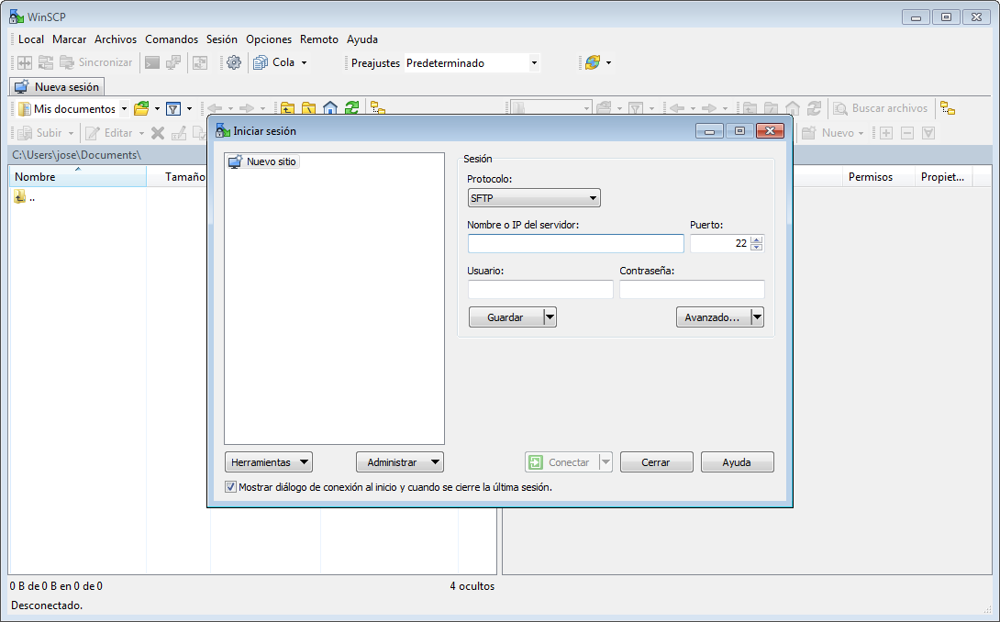
    </center>

2.  Complete los campos de la ventana *Iniciar sesión* con la siguiente información:

    -   **Protocolo:** SCP

    -   **Nombre o IP del servidor:** 148.206.50.62

    -   **Puerto:** 22

    -   **Usuario:** Su nombre de usuario

    -   **Contraseña:** Su contraseña

3.  Pulse el botón *Conectar*:
    <center>

    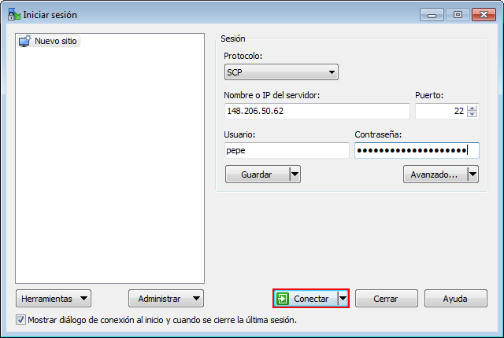
    </center>

4.  Si los datos proporcionados son correctos, se le mostrará la siguiente ventana:
    <center>

    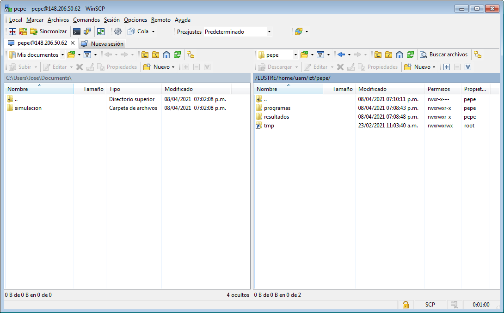
    </center>

    Este \"explorador\" se divide en dos secciones:

    -   La sección izquierda corresponde al equipo desde donde usted
        está conectado.

    -   La sección derecha corresponde al nodo de acceso al cual usted
        está conectado.

5.  Para transferir información, basta con arrastrar archivos/carpetas de una sección 
    a otra.

```admonish note title="NOTA"
Al conectarse por primera vez al clúster se le mostrará el siguiente mensaje:
<center>

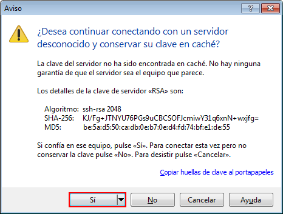
</center>

pulse en la opción *Sí* para continuar.

Este mensaje es para indicarle que el servidor al que se desea conectar, necesita 
guardar un identificador en su equipo para poder tener una sesión segura.
```

### Windows 10

En el sistema operativo *Windows 10*, usted puede transferir y respaldar información 
del clúster utilizando la interfaz de línea de comandos *Windows PowerShell*.

Para ejecutar *Windows PowerShell* siga los siguientes pasos:

1.  Presione la tecla \"Windows\" para desplegar el *Menú Inicio*,
    busque la carpeta *Windows PowerShell* y pulse en ella:
    <center>

    
    </center>

2.  Pulse en *Windows PowerShell*:
    <center>

    
    </center>

3.  Se abrirá la siguiente ventana:
    <center>

    
    </center>

    En esta ventana, usted debe ejecutar los comandos que se indican en las 
    secciones siguientes.

**Tranferencia de información**

Para transferir información del equipo local al clúster, utilice el comando `scp` 
siguiendo el formato que se muestra a continuación:
```
scp -Crp <origen del archivo/directorio> <nombre de usuario>@<dirección IP del nodo de acceso>:<destino del archivo/directorio>
```
><center>
>
>**Ejemplo: Transferencia de un directorio al clúster**
></center>
>
>En el siguiente ejemplo se copia el directorio *simulacion*, ubicado en el directorio 
>actual del usuario Jose, al directorio *programas*, ubicado en el directorio *home* 
>del usuario pepe:
>```
>PS C:\Users\Jose\Documents> scp -Crp simulacion pepe@148.206.50.62:programas
>```
>
>Una vez que se ha establecido la conexión, el sistema le solicitará su contraseña:
>```
>PS C:\Users\Jose\Documents> scp -Crp simulacion pepe@148.206.50.62:programas
>
>pepe@148.206.50.62's password
>```
>
>Si la contraseña proporcionada es correcta, la transferencia comenzará:
>```
>PS C:\Users\Jose\Documents> scp -Crp simulacion pepe@148.206.50.62:programas
>
>pepe@148.206.50.62's password
>datos.in                                    100%  145     1.1KB/s   00:00
>particulas.c                                100% 3010    37.9KB/s   00:00
>simulacion_particulas.slrm                  100%  381     4.8KB/s   00:00
>```

**Respaldar información**

Para respaldar información del clúster en el equipo local, utilice el comando `scp` 
siguiendo el formato que se muestra a continuación:
```
scp -Crp <nombre de usuario>@<dirección IP del nodo de acceso>:<origen del archivo/directorio> <destino del archivo/directorio>
```
><center>
>
>**Ejemplo: Respaldo de un directorio del clúster**
></center>
>
>En el siguiente ejemplo se descarga el directorio *resultados*, ubicado en el 
>directorio *home* del usuario pepe:
>```
>PS C:\Users\Jose\Downloads\> scp -Crp pepe@148.206.50.62:resultados .
>```
>
>Una vez que se ha establecido la conexión, el sistema le solicitará su contraseña:
>```
>PS C:\Users\Jose\Downloads\> scp -Crp pepe@148.206.50.62:resultados .
>
>pepe@148.206.50.62's password:
>```
>
>Si la contraseña proporcionada es correcta, la transferencia comenzará:
>```
>PS C:\Users\Jose\Downloads\> scp -Crp pepe@148.206.50.62:resultados .
>
>pepe@148.206.50.62's password:
>error_787945_1.err                          100%    0     0.0KB/s   00:00
>error_787945_2.err                          100%    0     0.0KB/s   00:00
>error_787945_3.err                          100%    0     0.0KB/s   00:00
>salida_787945_1.out                         100%   13     0.2KB/s   00:00
>salida_787945_2.out                         100%   14     0.2KB/s   00:00
>salida_787945_3.out                         100%   14     0.2KB/s   00:00
>```

```admonish note title="NOTA"
El `.` (punto) al final del comando indica que el directorio *resultados* se descargará 
en el directorio actual.
```
