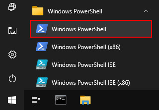

# Acceso al clúster

El acceso a los recursos de cómputo del clúster Yoltla es remoto y se realiza 
por medio de 2 servidores llamados nodos de acceso. Para conectarse a los 
nodos de acceso se requiere de un shell seguro (secure shell / SSH).

<center>


***Tabla 1. Nodos de acceso***
| **Nombre del nodo**   | **Dirección IP**  | 
|:---------------------:|:-----------------:|
|       yoltla0         | 148.206.50.61     |
|       yoltla1         | 148.206.50.62     |
</center>

```admonish warning title="IMPORTANTE"
La primera conexión debe realizarse al nodo de acceso `yoltla0`.
```
A continuación se detallan formas de realizar esta conexión desde Linux, Mac OS X 
y Windows.

## SSH GNU/Linux OS X

Desde la terminal ejecute el comando:
```
ssh -l <nombre de usuario> <dirección IP del nodo de acceso>
```

```admonish note title="NOTA"
Opción `-l` (letra ele minúscula).
```

Otra forma de realizar la conexión es utilizando la notación usuario@maquina:
```
ssh <nombre usuario>@<dirección IP del nodo de acceso>
```

><center>
>
>**Ejemplo: Conexión al clúster Yoltla**
></center>
>
>Conexión al nodo de acceso `yoltla0` con el usuario pepe:
>   ```
>    [jose@mi_PC ~]$ ssh -l pepe 148.206.50.61
>   ```
>Una vez que se ha establecido la conexión, el sistema le solicitará su contraseña:
>   ```
>    [jose@mi_PC ~]$ ssh -l pepe 148.206.50.61
>    pepe@148.206.50.61's password:
>   ```
>Si la contraseña proporcionada es correcta, se mostrará la pantalla de bienvenida de Yoltla:
>
>     !!!!!!!!!!!!!!!!!!!!!!!!!!!!!!!!!!!!!!!!!!!!!!!!!!!!!!!!!!!!!!!!!!!!!!!!!!!!
>
>                    ** Welcome to Supercomputer ***
>                    __   _____  _   _____ _        _
>                    \ \ / / _ \| | |_   _| |      / \
>                     \ V / | | | |   | | | |     / _ \
>                      | || |_| | |___| | | |___ / ___ \
>                      |_| \___/|_____|_| |_____/_/   \_\
>
>     ############################################################################
>
```admonish note title="NOTA"
La primera vez que se conecte al clúster se le mostrará el siguiente mensaje:

    [jose@mi_PC ~]$ ssh -l pepe 148.206.50.61
    The authenticity of host '148.206.50.61 (148.206.50.61)' can't be established.
    RSA key fingerprint is SHA256:ivxk1BSj+OaS9JGCwUoVwuDJnxlU2YWxKD34m1XPAd8.
    This key is not known by any other names
    Are you sure you want to continue connecting (yes/no/[fingerprint])?
    
Este mensaje es para indicarle que el servidor al que se desea conectar, necesita guardar 
un identificador en su equipo para poder tener una sesión segura. Escriba la palabra "yes" 
y presione la tecla "Enter" para continuar:

    Are you sure you want to continue connecting (yes/no)? yes
    Warning: Permanently added '148.206.50.61' (RSA) to the list of known hosts.
```

## SSH Windows

Para el sistema operativo Windows existen varias alternativas comerciales y libres de 
clientes SSH. Los siguientes dos clientes son gratuitos y sabemos que funcionan bien
para realizar conexiones hacia los nodos de acceso desde el sistema operativo Windows:

-   [PuTTY](https://portableapps.com/apps/internet/putty_portable)

-   [SmarTTY](http://smartty.sysprogs.com/)

```admonish note title="NOTA"
Las versiones portables de estos clientes no requieren instalación y pueden ser 
ejecutadas directamente.
```

**PuTTY: Conexión al clúster Yoltla**

1.  Ejecute *PuTTY*. Al iniciar el programa se le mostrará la siguiente
    pantalla:
    <center>

    
    </center>
    
2.  Complete los campos de la ventana *PuTTY Configuration* con la siguiente 
    información:

    -   **Host Name (or IP address):** 148.206.50.61

    -   **Port:** 22

    -   **Connection type:** SSH

3.  Pulse el botón *Open*:
    <center>

    
    </center>

4.  Se abrirá una nueva ventana en donde se le solicitará su nombre de usuario y 
    su contraseña:
    <center>

    
    </center>

5.  Si los datos proporcionados son correctos, se mostrará la pantalla de bienvenida 
    de Yoltla:
    <center>

    
    </center>

```admonish note title="NOTA" 
Al conectarse por primera vez al clúster se le mostrará el siguiente mensaje:
<center>


</center>

pulse el botón *Sí* para continuar.

Este mensaje es para indicarle que el servidor al que se desea conectar, necesita 
guardar un identificador en su equipo para poder tener una sesión segura.
```

**SmarTTY: Conexión al clúster Yoltla**

1.  Ejecute *SmarTTY*. Al iniciar el programa se le mostrará la siguiente 
    pantalla:
    <center>

    
    </center>

    pulse en el texto *Quick SSH conection...*

2.  Se abrirá la siguiente ventana:
    <center>

    
    </center>

3.  Complete los campos de la ventana *Quick SSH Conection* con la siguiente 
    información:

    -   **Machine:** \<Su nombre de usuario\>@148.206.50.61

    -   **Password:** Su contraseña

4.  Pulse el botón *OK*:
    <center>

    
    </center>

5.  Si los datos proporcionados son correctos, se abrirá la siguiente ventana:
    <center>

    
    </center>

    pulse el botón *Start with a regular Terminal*.

6.  Finalmente, se mostrará la pantalla de bienvenida de Yoltla:
    <center>

    
    </center>

```admonish note title="NOTA"
Al conectarse por primera vez al clúster se le mostrará el siguiente mensaje:
<center>


</center>

pulse el botón *Save* para continuar.

Este mensaje es para indicarle que el servidor al que se desea conectar, necesita 
guardar un identificador en su equipo para poder tener una sesión segura.
```

**Cliente SSH**

Para instalar (habilitar) el cliente SSH de este sistema, siga los siguientes pasos:

1.  Presione la tecla "Windows" para desplegar el _Menú Inicio_ y pulse en la opción _Configuración_ (se abrirá una nueva ventana):
    <center>

    
    </center>

2.  Busque la sección _Aplicaciones_ y pulse en ella:
    <center>

    
    </center>

3.  En la sección _Aplicaciones y características_, pulse en la opción _Características opcionales_:
    <center>

    
    </center>

4.  Pulse en _Agregar una nueva característica_ (se abrirá una nueva ventana):
    <center>

    
    </center>

5.  Busque la característica _Cliente de OpenSSH_, selecciónela y pulse el botón _Instalar_:
    <center>

    
    </center>

6.  Espere a que la instalación termine:
    <center>

    
    </center>

7.  Reinicie el sistema para que los cambios se apliquen. 

**Windows PowerShell**

Para ejecutar _Windows PowerShell_, siga los siguientes pasos:

1.  Presione la tecla "Windows" para desplegar el _Menú Inicio_, busque la carpeta _Windows PowerShell_ y pulse en ella:
    <center>

    
    </center>

2.  Pulse en _Windows PowerShell_:
    <center>

    
    </center>

3.  Se abrirá la siguiente ventana: 
    <center>

    
    </center>

    En esta ventana usted debe realizar la conexión al clúster.

><center>
>
>**Ejemplo: Conexión al clúster Yoltla**
></center>
>
>Conexión al nodo de acceso yoltla0 con el usuario pepe:
>```
>    PS C:\Users\Jose\> ssh -l pepe 148.206.50.61
>```
>
>Una vez que se ha establecido la conexión, el sistema le solicitará su contraseña:
>```
>    PS C:\Users\Jose\> ssh -l pepe 148.206.50.61
>
>    pepe@148.206.50.61's password:
>```
>
>     !!!!!!!!!!!!!!!!!!!!!!!!!!!!!!!!!!!!!!!!!!!!!!!!!!!!!!!!!!!!!!!!!!!!!!!!!!!!
>
>                    ** Welcome to Supercomputer ***
>                    __   _____  _   _____ _        _
>                    \ \ / / _ \| | |_   _| |      / \
>                     \ V / | | | |   | | | |     / _ \
>                      | || |_| | |___| | | |___ / ___ \
>                      |_| \___/|_____|_| |_____/_/   \_\
>
>     ############################################################################
>
```admonish note title="NOTA"
La primera vez que se conecte al clúster se le mostrará el siguiente mensaje:

    PS C:\Users\Jose> ssh -l c.553 148.206.50.61
    The authenticity of host '148.206.50.61 (148.206.50.61)' can't be established.
    RSA key fingerprint is SHA256:ivxk1BSj+OaS9JGCwUoVwuDJnxlU2YWxKD34m1XPAd8.
    Are you sure you want to continue connecting (yes/no)? yes
    Warning: Permanently added '148.206.50.61' (RSA) to the list of known hosts.

Este mensaje es para indicarle que el servidor al que se desea conectar, 
necesita guardar un identificador en su equipo para poder tener una sesión segura. 
Escriba la palabra "yes" y presione la tecla "Enter" para continuar:

    Are you sure you want to continue connecting (yes/no)? yes
    Warning: Permanently added '148.206.50.61' (RSA) to the list of known hosts.
```

## Cambio de contraseña

La primera actividad a realizar cuando se conecta un nuevo usuario al clúster Yoltla es asignar
una nueva contraseña a su cuenta. Utilice el comando `passwd` para cambiar su contraseña.

Las políticas establecidas en el clúster para asignación de contraseñas son:

-   Debe estar formada por al menos 8 caracteres *(sin espacios)*
-   Debe contener un carácter minúscula *(a-z)*
-   Debe contener un carácter mayúscula *(A-Z)*
-   Debe contener un carácter numérico *(0-9)*
-   Debe contener un carácter especial *(! " # $ % & ' ( ) * + , - . / @)*

Al realizarse la primera conexión y después de establecer su nueva contraseña, la conexión se cerrará. 
Al volver a conectarse utilice su nueva contraseña.


```admonish warning title="IMPORTANTE"
La sincronización de contraseñas entre ambos nodos de acceso tomará un par de horas.
```

><center>
>
>**Ejemplo: Cambio de contraseña**
></center>
>
>Cambio de contraseña del usuario pepe:
>```
>   [pepe@yoltla0 ~]$ passwd
>```
>
>El sistema le solicitará su contraseña actual:
>```
>   [pepe@yoltla0 ~]$ passwd
>   Changing password for user pepe.
>   Changing password for pepe.
>   (current) UNIX password:
>```
>
>A continuación, si la contraseña proporcionada es correcta, el sistema le solicitará escribir 
>su nueva contraseña dos veces:
>```
>   [pepe@yoltla0 ~]$ passwd
>   Changing password for user pepe.
>   Changing password for pepe.
>   (current) UNIX password:
>   New YOLTLA password: 
>   Retype new YOLTLA password: 
>```
>
>Finalmente, si las dos contraseñas coinciden, se le mostrará el siguiente mensaje:
>```
>   passwd: all authentication tokens updated successfully.
>```