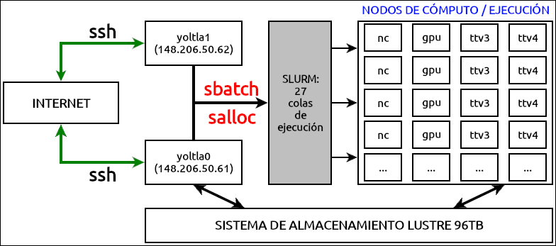

# Creación de scripts
<center>


*Figura 1. Diagrama de la configuración y funcionamiento del clúster Yoltla*
</center>

Para utilizar los recursos del cluster Yoltla se debe mandar un script de SLURM.

Un script de SLURM consta de dos partes: directivas SLURM y comandos.

-   **Directivas.** Establecen las opciones con las que se va a ejecutar el trabajo. 

-   **Comandos.** Son las instrucciones necesarias para ejecutar el trabajo.
 
Las principales directivas para SLURM son:

|   **Directiva**         |   **Descripción**            |   **Uso**   |
|-------------------      |---------------------         |-------------|
|  --job-name=trabajo     |  Nombre del trabajo.         |  Opcional  |
|  --output=salida        |  Salida estándar.            |  Opcional  |
|  --error=error          |  Error estándar.             |  Opcional  |
|  --partition=partición  |  Nombre de la partición.     |  Obligatorio  |
|  --time=dd-hh:mm:ss     |  Tiempo máximo de ejecución. |  Obligatorio  |
|  --nodes=#              |  Número de nodos.            |  Obligatorio  |
|  --ntasks-per-node=#    |  Número de tareas por nodo.  |  Obligatorio  |
|  --cpus-per-task=#      |  Número de CPUs por tarea.   |  Obligatorio  |
|  --mem=#                |  Memoria por nodo.           |  Opcional     |
|  --mail-user=email      |  Correo electrónico del usuario.  |  Opcional  |
|  --mail-type=eventos    |  Eventos que se notificarán por correo electrónico.  |  Opcional  |

```admonish warning title="IMPORTANTE"
Sólo utilice la directiva:
    
        --cpus-per-task=#
    
cuando trabaje con programas de memoria compartida (OpenMP).
```


Para obtener información más detallada de cada una de estas directivas, consulte la 
sección [Directivas de SLURM](../anexos/anexos.md#directivas-de-slurm).

A continuación se presenta un ejemplo de un script:

***hola_mundo.slrm***
```
#!/bin/bash
#SBATCH --job-name=hola_mundo
#SBATCH --output=salida_%j.out
#SBATCH --error=error_%j.err
#SBATCH --partition=q1h-20p
#SBATCH --time=0-00:00:10
#SBATCH --nodes=1
#SBATCH --ntasks-per-node=20
#SBATCH --mail-user=pepe@host.com
#SBATCH --mail-type=all

srun echo "Hola Mundo!"
```

Si desea ver más ejemplos, consulte la sección 
[Scripts de ejemplo](../anexos/anexos.md#scripts-de-ejemplo).