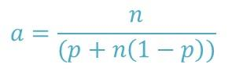

# Escalabilidad

Cuando ejecutamos aplicaciones en clústeres HPC utilizando SLURM, es 
común buscar una reducción del tiempo de ejecución agregando más 
procesadores. Sin embargo, existe un límite en la escalabilidad definido 
por la **Ley de Amdahl**, la cual establece que la mejora del 
rendimiento está limitada por la parte secuencial del código.

## Ley de Amdahl

La Ley de Amdahl se expresa como:

<center>


</center>

Donde:

- **a**: aceleración del programa
- **n**: número de procesadores
- **p**: fracción del código que puede paralelizarse (0 a 1)

**Ejemplo de impacto en la escalabilidad**

Si una aplicación es 80% paralelizable (**p = 0.8**), su aceleración 
teórica máxima será **5×**, sin importar cuántos núcleos agreguemos. 
Esto significa que llega un punto en el que agregar más recursos no 
mejora el tiempo de ejecución.

En SLURM, esto afecta directamente a la eficiencia de los *Job Arrays*, 
ya que si cada tarea dentro del arreglo tiene una alta dependencia de E/S 
o comunicación, el rendimiento disminuirá en lugar de mejorar.


## Implementando Job Arrays en SLURM

Los *Job Arrays* en SLURM permiten ejecutar múltiples instancias de un 
trabajo con un solo script de envío. La sintaxis básica es:

```bash
#!/bin/bash
#SBATCH --job-name=array_test
#SBATCH --array=1-10    # Ejecutará 10 trabajos en paralelo
#SBATCH --ntasks=1      # Un solo proceso por tarea
#SBATCH --cpus-per-task=2  # Número de CPUs por tarea
#SBATCH --time=00:10:00  # Tiempo límite
#SBATCH --output=output_%A_%a.txt

srun ./mi_script $SLURM_ARRAY_TASK_ID
```

Aquí, `SLURM_ARRAY_TASK_ID` se usa para diferenciar cada instancia del 
trabajo.

### Consejos para mejorar la escalabilidad de los Job Arrays

1. **Evitar Cuellos de Botella en E/S**

   - Si todos los trabajos acceden simultáneamente a un mismo archivo de 
   entrada/salida, se puede crear un cuello de botella. Considera 
   distribuir los datos o usar [*MPI-IO*](https://docs-open--mpi-org.translate.goog/en/main/tuning-apps/mpi-io/ompio.html?_x_tr_sl=en&_x_tr_tl=es&_x_tr_hl=es&_x_tr_pto=tc).
   
   - Si es posible, pre-cargar datos en memoria o dividirlos en archivos 
   separados para cada tarea.

2. **Optimizar la Asignación de Recursos**

   - Si cada tarea requiere mucha CPU o memoria, reduce el número de 
   tareas concurrentes con `--array=1-10%5` (ejecutando solo 5 trabajos 
   simultáneamente).
   
   - Usa `--cpus-per-task` adecuadamente para tareas con múltiples hilos.

3. **Reducir la Sobrecarga de Comunicación**

   - Si las tareas dentro del *Job Array* necesitan comunicarse, usa un 
   modelo eficiente como **MPI** en lugar de que cada tarea se comunique 
   individualmente con un nodo central.
   
   - Evita sincronizaciones innecesarias entre procesos.

4. **Monitorear y Ajustar**

   - Usa `sacct` para analizar tiempos de ejecución y detectar 
   ineficiencias:
     ```bash
     sacct --format=JobID,JobName,Elapsed,MaxRSS,State
     ```
   
   - Si el tiempo de ejecución de cada tarea varía demasiado, considera 
   usar `--time-min` para evitar desperdicio de recursos.

## Paralelización de la E/S con MPI-IO

Una de las principales limitaciones en escalabilidad es la E/S 
secuencial. Para optimizar este aspecto, se recomienda usar [*MPI-IO*](https://docs-open--mpi-org.translate.goog/en/main/tuning-apps/mpi-io/ompio.html?_x_tr_sl=en&_x_tr_tl=es&_x_tr_hl=es&_x_tr_pto=tc), 
que permite que múltiples procesos escriban en un mismo archivo de forma 
paralela.

Ejemplo de código MPI-IO en C:

```c
#include <mpi.h>
#include <stdio.h>
int main(int argc, char** argv) {
    MPI_Init(&argc, &argv);
    int rank;
    MPI_Comm_rank(MPI_COMM_WORLD, &rank);
    MPI_File fh;
    MPI_File_open(MPI_COMM_WORLD, "output.txt", MPI_MODE_CREATE | MPI_MODE_WRONLY, MPI_INFO_NULL, &fh);
    char buffer[100];
    sprintf(buffer, "Proceso %d escribiendo...\n", rank);
    MPI_File_write_at(fh, rank * 100, buffer, 100, MPI_CHAR, MPI_STATUS_IGNORE);
    MPI_File_close(&fh);
    MPI_Finalize();
    return 0;
}
```

Para ejecutar en SLURM:
```bash
srun --ntasks=4 ./mi_script
```
Esto permite que los procesos escriban en paralelo, reduciendo la 
latencia de E/S.


