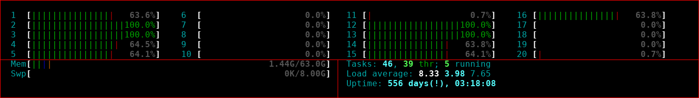
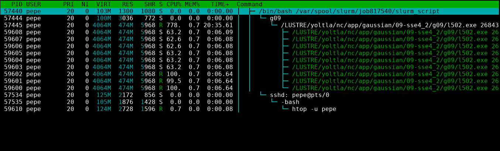

# htop

htop es un visor de procesos interactivo.

## Iniciar la aplicación

Para iniciar la aplicación htop, utilice el comando `htop` seguido de la opción `-u` y 
su nombre de usuario:
``` bash
    htop -u <nombre de usuario>
```

```admonish note title="NOTA"
Si ejecuta el comando `htop` sin ninguna opción, se mostrarán los procesos de todos 
los usuarios del sistema.
```

El aspecto de la terminal cambiará al siguiente:
<center>


</center>

La interfaz de htop se divide en tres secciones:

-   **Cabecera.** Muestra información sobre el uso de CPU, memoria RAM y memoria SWAP, 
    el número de procesos activos (Tasks), la carga media (Load average) y el tiempo 
    de actividad del sistema (Uptime).

-   **Tabla de procesos.** Lista todos los procesos activos en el sistema.

-   **Pie de página.** Atajos de teclado para comandos de htop.

## Cabecera

En esta sección se encuentra resumen de los recursos del sistema y de su uso.
<center>


</center>

A continuación se da una descripción de los elementos que conforman esta sección:

-   En la parte superior se encuentran varias barras numeradas del 1 al n, las cuales 
    representan las CPUs del sistema y su carga.

-   En la parte inferior izquierda se encuentran dos barras con las palabras `Mem` y `Swp`, 
    las cuales representan, respectivamente, el uso de memoria RAM y SWAP en el sistema.

-   En la parte inferior derecha se encuentran los siguientes elementos:

    -   **Tasks.** Número de procesos activos en el sistema. Hay tres valores asociados 
        a este elemento: el primero representa el número total de procesos, el segundo 
        el número de subprocesos y el tercero el número de procesos en ejecución.

    -   **Load average.** Carga media del sistema. Hay tres números asociados a este 
        elemento: el primero representa la carga media del último minuto, el segundo 
        la carga media de los últimos cinco minutos y el tercero la carga media de los 
        últimos quinceminutos.

    -   **Uptime.** Tiempo de actividad del sistema desde su último reinicio.

```admonish note title="NOTA"
El uso de la memoria SWAP debe ser 0. Si su aplicación está utilizando memoria SWAP, 
se comportará de manera muy lenta.
```

```admonish note title="NOTA"
En general, la carga media debe ser igual al número de CPUs en el sistema. En este 
ejemplo, la carga media debe ser 20.
```

## Tabla de procesos

En esta sección se listan todos los procesos activos en el sistema.
<center>


</center>

```admonish note title="NOTA"
Puede desplazarse por la tabla de procesos utilizando las flechas de dirección o 
el ratón. Una barra de color azul resalta el proceso seleccionado actualmente.
```

A continuación se da una descripción de las columnas que conforman esta tabla:

|   **Columna**     |   **Descripción**                             |
|-------------------|-----------------------------------------------|
|   PID             | Número de identificación del proceso.         |
|   USER            | Nombre del usuario propietario del proceso    |
|   PRI             | Prioridad del proceso en el kernel.           |
|   NI              | Prioridad (valor nice) del proceso.           |
|   VIRT            | Memoria virtual que consume el proceso.       |
|   RES             | Memoria física que consume el proceso.        |
|   SHR             | Memoria compartida que consume el proceso.    |
|   S               | Estado del proceso.                           |
|   CPU%            | Porcentaje de CPU que consume el proceso.     |
|   MEM%            | Porcentaje de memoria que consume el proceso. |
|   TIME+           | Tiempo, medido en tics de reloj, desde que se inició la ejecución del proceso. |
|   Command         | Nombre del comando que inició el proceso.     |

## Pie de página

En esta sección se encuentran atajos de teclado para algunos comandos de htop.
<center>


</center>

A continuación se da una descripción de cada uno de los atajos:


|   **Atajo**   |   **Descripción**                     |
|---------------|---------------------------------------|
|   F1          | Ir a la pantalla de ayuda.            |
|   F2          | Ir a la pantalla de configuración.    |
|   F3          | Buscar un proceso por nombre.         |
|   F4          | Filtrar los procesos utilizando una palabra clave. |
|   F5          | Activar/desactivar la vista de árbol. |
|   F6          | Ordenar los procesos por columna.     |
|   F7          | Aumentar la prioridad (valor nice) del proceso seleccionado. |
|   F8          | Disminuir la prioridad (valor nice ) del proceso seleccionado. |
|   F9          | Matar el proceso seleccionado.        |
|   F10         | Salir de htop.                        |

```admonish note title="NOTA"
En la vista de árbol se muestra la relación de cada proceso del sistema 
y sus subprocesos. 
```

Para obtener más información de la aplicación htop, consulte su 
[página oficial](https://htop.dev/).