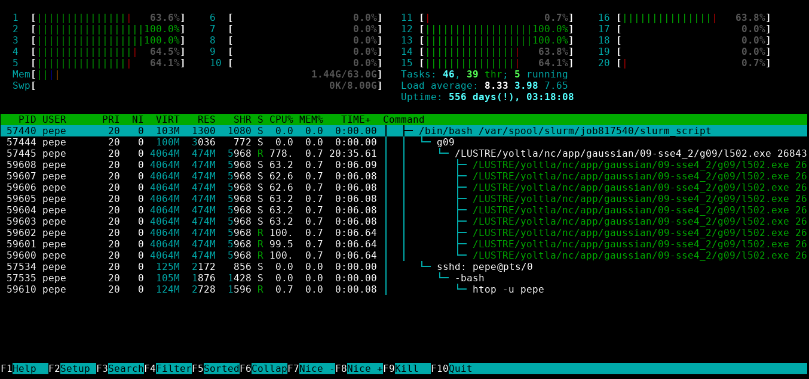

# Monitoreo de trabajos

Puede monitorear un trabajo conectándose al nodo en el que se está ejecutando y utilizando 
la aplicación htop.

## Consultar el nodo de ejecución

Para consultar en que nodo se está ejecutando un trabajo utilice el comando `squeue` 
(ver sección [Consultar un trabajo](./envio_y_administracion_de_trabajos.md#consultar-un-trabajo)) o el comando `sacct` (ver sección 
[Historial de trabajos](./historial_de_trabajos.md)).

Por ejemplo, para consultar en que nodo se está ejecutando el trabajo con ID 817543, 
ejecute el comando:
```
[pepe@yoltla0 ~]$  squeue -j 817543
    JOBID PARTITION     NAME     USER ST       TIME  NODES NODELIST(REASON)
    817543   q1h-20p script_g     pepe  R      10:15      1 nc87
```

En este caso, el trabajo con ID 817543 se está ejecutando en el nodo nc87.

```admonish note title="NOTA"
Si un trabajo utiliza MPI, es posible que se esté ejecutando en varios nodos. 
```

## Conectarse a un nodo

Para conectarse a un nodo, utilice el comando `ssh` seguido del nombre del nodo:
```
ssh <nombre del nodo>
```

```admonish note title="NOTA"
Solo podrá conectarse a un nodo, si en él se esta ejecutando alguno de sus trabajos. 
Una vez que el trabajo haya concluido la conexión terminará.
```

Por ejemplo, para conectarse al nodo nc87, ejecute el comando:
```
[pepe@yoltla0 ~]$ ssh nc87
Warning: Permanently added 'nc87,10.10.200.87' (RSA) to the list of known hosts.
[pepe@nc87 ~]$ 
```

```admonish note title="NOTA"
Es posible que en algunos casos se le solicite su contraseña para tener acceso al nodo.
```

## Monitorear un trabajo

Para monitorear un trabajo, utilice el comando `htop` seguido de la opción `-u` y su 
nombre de usuario:
```
htop -u <nombre de usuario>
```

```admonish note title="NOTA"
Recuerde que debe estar conectado al nodo en que se está ejecutando su trabajo.
```

Por ejemplo, para el usuario pepe, el comando correspondiente es el siguiente:
```
[pepe@nc87 ~]$ htop -u pepe
```

Después de ejecutar este comando, el aspecto de la terminal cambiará al que se muestra 
a continuación:
<center>


</center>

Desde esta interfaz puede monitorear el uso de CPU, el uso de memoria RAM y el tiempo 
que se ha estado ejecutando su trabajo. Presione la tecla `q` para salir. 


Para obtener más información del uso de la aplicación htop consulte la sección [htop](./htop.md).

```admonish note title="NOTA"
Si el comportamiento de su trabajo no es el esperado, puede cancelar el trabajo utilizando el 
comando `scancel` (ver sección [Cancelar un trabajo](./envio_y_administracion_de_trabajos.md#cancelar-un-trabajo)).

Si necesita soporte adicional, envíe un correo a <soporte.lsvp@gmail.com>.
```

## Desconectarse de un nodo

Para desconectarse de un nodo, ejecute el comando:
```
exit
```

En nuestro ejemplo, al desconectarnos del nodo nc87, obtenemos la siguiente salida:
```
[pepe@nc87 ~]$ exit
logout
Connection to nc87 closed.
[pepe@yoltla0 ~]$
```