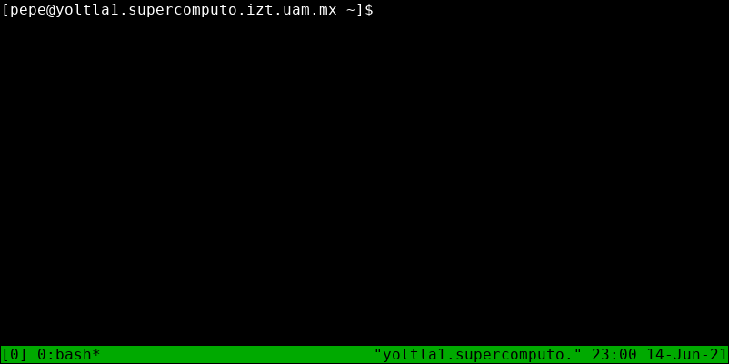
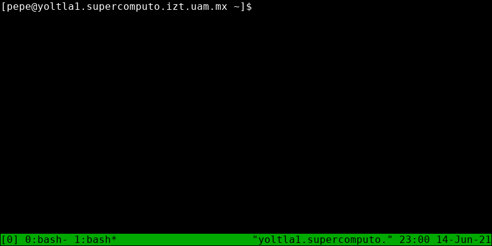
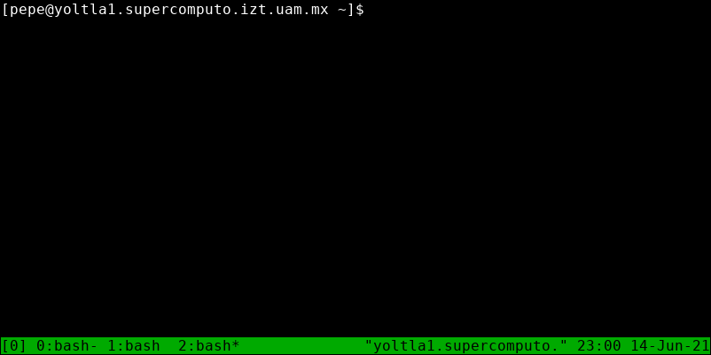
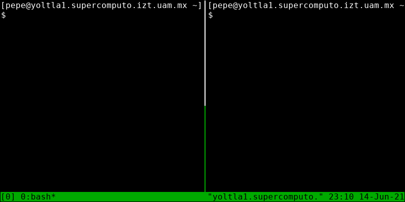
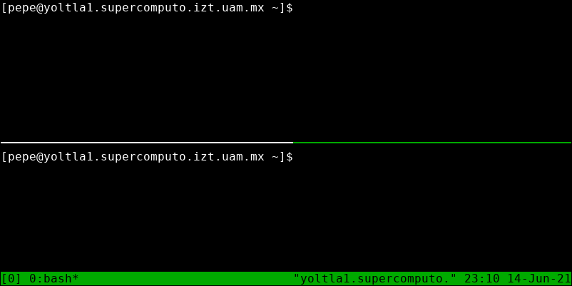
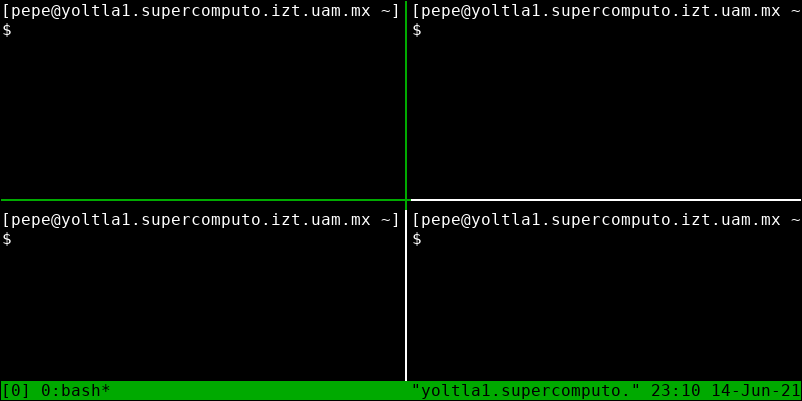
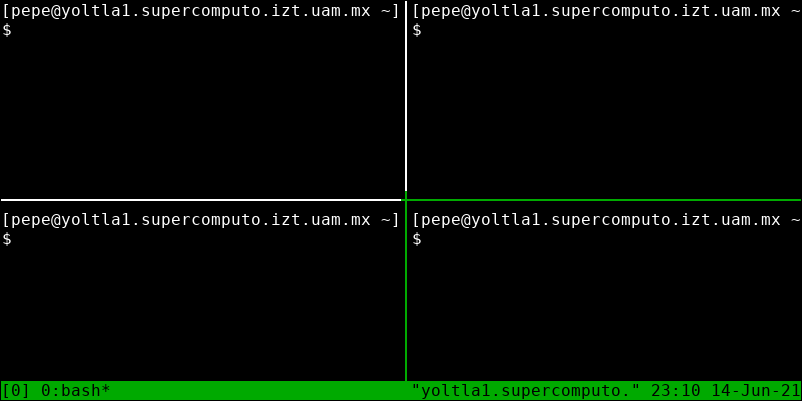

# Multiplexor de terminales (tmux)

Tmux es un programa para terminal que permite dividir una consola en múltiples secciones. 
Es útil para realizar muchas tareas al mismo tiempo sin tener que crear mas de una conexión.

## Cargar la aplicación

Para utilizar `tmux` es necesario cargar su módulo correspondiente. 
Utilice el comando:
```
    module load tools/tmux/2.0
```

para cargar la aplicación tmux.

## Crear una sesión

Para crear una sesión en tmux, utilice el siguiente comando:
```
    tmux new-session
```

El aspecto de la terminal cambiará al siguiente:
<center>


</center>

En la parte inferior de la terminal se añadirá una barra de color verde, llamada línea 
de estado. En la línea de estado se muestran los siguientes elementos:

-   A la izquierda, el nombre de la sesión.

-   En el centro, una lista de las ventanas de la sesión, con su índice.

-   A la derecha, el título del panel entre comillas (por defecto es el
    nombre del anfitrión que ejecuta tmux) y, la hora y la fecha.

```admonish note title="NOTA"
De forma predeterminada, tmux le asigna un nombre a cada sesión, la primera sesión se 
llamará *0*, la segunda *1* y así sucesivamente. Puede especificar un nombre para la 
sesión utilizando la opción `-s`:

        tmux new-session -s <nombre de la sesión>
```

## Crear una ventana

Por defecto, al crear una sesión en tmux, se crea una sola ventana, sin embargo, puede 
crear múltiples ventanas en una misma sesión.

Para crear una nueva ventana, presione las teclas `Ctrl + b`, y después presione la tecla `c`:
<center>


</center>

La nueva ventana se convertirá en la ventana activa.

```admonish note title="NOTA"
En la línea de estado, un `*` (asterisco) junto al nombre de la ventana indica que 
es la ventana activa.
```

## Navegar entre ventanas

Para navegar entre las diferentes ventanas de una sesión de tmux, presione las teclas 
`Ctrl + b`, y después presione la tecla correspondiente al índice de la ventana.

Por ejemplo, en la siguiente sesión se tienen 3 ventanas:
<center>


</center>

Para cambiar a la ventana 2, presione las teclas `Ctrl + b`, y después
presione la tecla `2`.
<center>


</center>

## Crear un panel

Además de poder crear múltiples ventanas en una sesión de tmux, es posible dividir una 
ventana para crear múltiples paneles. Una ventana se puede divir de manera horizontal 
o vertical.

Para dividir una ventana horizontalmente, presione las teclas `Ctrl + b`, y después 
presione la tecla `%` (porcentaje):
<center>


</center>

El nuevo panel se convertirá en el panel activo.

Para dividir una ventana verticalmente, presione las teclas `Ctrl + b`, y después presione 
la tecla `"` (comillas dobles):
<center>


</center>

El nuevo panel se convertirá en el panel activo.

```admonish note title="NOTA"
Un borde de color verde indica el panel activo.
```

## Navegar entre panales

Para navegar entre los diferentes paneles de una ventana, presione las teclas `Ctrl + b`, 
y después presione alguna de las teclas de dirección.

Por ejemplo, la siguiente ventana se encuentra divida en cuatro paneles:
<center>


</center>

Para navegar desde el panel superior izquierdo al panel inferior derecho, siga los 
siguientes pasos:

1.  Presione las teclas `Ctrl + b`, y después presione la tecla `→`
    (derecha).

2.  Presione las teclas `Ctrl + b`, y después presione la tecla `↓`
    (abajo).
<center>


</center>

## Eliminar un panel/ventana

Para eliminar un panel/ventana de una sesión de tmux, primero navegue al panel/ventana 
que desea eliminar y después presione las teclas `Ctrl + d`.

```admonish note title="NOTA"
Si la sesión solo cuenta con una ventana y esta es eliminada, la sesión se terminará.
```

## Desconectarse de una sesión

Para desconectarse de una sesión, presione las teclas `Ctrl + b`, y después presione la tecla `d`.

Al desconectarse de una sesión, regresará a la terminal y se imprimirá un mensaje con el nombre 
de la sesión, la sesión de tmux y cualquier programa dentro de ella seguirá ejecutándose en 
segundo plano.

Por ejemplo, al desconectarse de la sesión con nombre *aplicaciones*, se muestra el siguiente mensaje:
```
[pepe@yoltla0 ~]$ tmux new-session -s aplicaciones
[detached (from session aplicaciones)]
```

## Conectarse a una sesión

Para conectarse a una sesión, utilice el siguiente comando:
```
    tmux attach -t <nombre de la sesión>
```

Por ejemplo, para conectarse a la sesión *aplicaciones*, ejecute el comando:
```
    [pepe@yoltla0 ~]$ tmux attach -t aplicaciones
```

## Listar las sesiones

Para obtener un listado de todas las sesiones disponibles, utilice el comando:
```
    tmux ls
```
Por ejemplo, el usuario pepe tiene las siguientes sesiones disponibles:
```
[pepe@yoltla0 ~]$ tmux ls
prueba: 2 windows (created Mon Jun 5 16:15:12 2021)
aplicaciones: 5 windows (created Mon Jun 5 16:30:03 2021)
simulacion: 3 windows (created Mon Jun 8 18:00:06 2021)
```

## Eliminar una sesión

Para eliminar una sesión, utilice el comando:
```
    tmux kill-session -t <nombre de la sesión>
```

Por ejemplo, para eliminar la sesión *prueba*, ejecute el comando:
```
    [pepe@yoltla0 ~]$ tmux kill-session prueba
```

Al utilizar este comando no obtendrá ningún mensaje por parte del sistema.

Para obtener más información de la aplicación tmux, consulte la página 
[Getting Started](https://github.com/tmux/tmux/wiki/Getting-Started) de 
la wiki oficial de tmux.