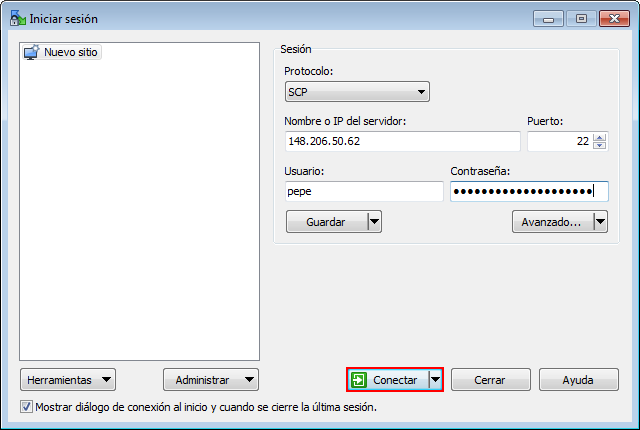

# Transferencia y respaldo de información

```admonish warning title="IMPORTANTE"
La transferencia y respaldo de información debe realizarse por medio del nodo de 
acceso `yoltla1` (148.206.50.62).
```

## GNU/Linux

**Transferencia de onformación**

Para transferir información del equipo local al clúster, utilice el comando `scp` 
siguiendo el formato que se muestra a continuación:
```
scp -Crp <origen del archivo/directorio> <nombre de usuario>@<dirección IP del nodo de acceso>:<destino del archivo/directorio>
```

Otra forma, mas confiable, de transferir información al clúster es utilizando el 
comando `rsync`:
```
rsync -Paz <origen del archivo/directorio> <nombre de usuario>@<dirección IP del nodo de acceso>:<destino del archivo/directorio>
```

><center>
>
>**Ejemplo: Tranferencia de un directorio al clúster**
></center>
>
>En el siguiente ejemplo se copia el directorio *simulacion*, ubicado en el directorio 
>actual del usuario jose, al directorio *programas*, ubicado en el directorio *home* 
>del usuario pepe:
>```
>[jose@mi_PC Documentos]$ scp -Crp simulacion pepe@148.206.50.62:programas
>```        
>
>Una vez que se ha establecido la conexión, el sistema le solicitará su contraseña:
>```
>[jose@mi_PC Documentos]$ scp -Crp simulacion pepe@148.206.50.62:programas
>
>pepe@148.206.50.62's password:
>```
>
>Si la contraseña proporcionada es correcta, la transferencia comenzará:
>```
>[jose@mi_PC Documentos]$ scp -Crp simulacion pepe@148.206.50.62:programas
>
>pepe@148.206.50.62's password:
>simulacion_particulas.slrm                  100%  381     4.4KB/s   00:00
>particulas.c                                100% 3010    36.2KB/s   00:00
>datos.in                                    100%  145     1.8KB/s   00:00
>```

**Respaldo de información**

Para respaldar información del clúster en el equipo local, utilice el comando `scp` 
siguiendo el formato que se muestra a continuación:
```
scp -Crp <nombre de usuario>@<dirección IP del nodo de acceso>:<origen del archivo/directorio> <destino del archivo/directorio>
```

Otra forma, más confiable, de respaldar información del clúster es utilizando el 
comando `rsync`:
```
rsync -Paz <nombre de usuario>@<dirección IP del nodo de acceso>:<origen del archivo/directorio> <destino del archivo/directorio>
```

><center>
>
>**Ejemplo: Respaldo de un directorio del clúster**
></center>
>
>En el siguiente ejemplo se descarga el directorio *resultados*, ubicado en el 
>directorio *home* del usuario pepe:
>```
>[jose@mi_PC Descargas]$ scp -Crp pepe@148.206.50.62:resultados .
>```
>
>Una vez que se ha establecido la conexión, el sistema le solicitará su contraseña:
>```
>[jose@mi_PC Descargas]$ scp -Crp pepe@148.206.50.62:resultados .
>
>pepe@148.206.50.62's password:
>```
>
>Si la contraseña proporcionada es correcta, la transferencia comenzará:
>```
>[jose@mi_PC Descargas]$ scp -Crp pepe@148.206.50.62:resultados .
>
>pepe@148.206.50.62's password:
>salida_787945_2.out                         100%   14     0.2KB/s   00:00
>salida_787945_3.out                         100%   14     0.2KB/s   00:00
>error_787945_2.err                          100%    0     0.0KB/s   00:00
>error_787945_1.err                          100%    0     0.0KB/s   00:00
>salida_787945_1.out                         100%   13     0.2KB/s   00:00
>error_787945_3.err                          100%    0     0.0KB/s   00:00    
>```

```admonish note title="NOTA"
El `.` (punto) al final del comando indica que el directorio *resultados* se descargará 
en el directorio actual.
```

```admonish tip title="TIP"
Con `rsync` se puede detener la transeferencia de archivos en cualquier momento y reanudarla 
desde donde se dejó al repetir el comando.
```

## Windows

Para poder transferir información entre su equipo y el clúster, se puede usar el software 
*WinSCP*, que puede encontrar en el siguiente [enlace](https://winscp.net/eng/index.php).

Se puede descargar e instalar *WinSCP* como cualquier otra aplicación de windows.

Una vez instalado el software, siga los siguientes pasos:

1.  Ejecute *WinSCP*. Al iniciar el programa se le mostrará la siguiente pantalla:
    <center>

    
    </center>

2.  Complete los campos de la ventana *Iniciar sesión* con la siguiente información:

    -   **Protocolo:** SCP

    -   **Nombre o IP del servidor:** 148.206.50.62

    -   **Puerto:** 22

    -   **Usuario:** Su nombre de usuario

    -   **Contraseña:** Su contraseña

3.  Pulse el botón *Conectar*:
    <center>

    
    </center>

4.  Si los datos proporcionados son correctos, se le mostrará la siguiente ventana:
    <center>

    
    </center>

    Este \"explorador\" se divide en dos secciones:

    -   La sección izquierda corresponde al equipo desde donde usted
        está conectado.

    -   La sección derecha corresponde al nodo de acceso al cual usted
        está conectado.

5.  Para transferir información, basta con arrastrar archivos/carpetas de una sección 
    a otra.

```admonish note title="NOTA"
Al conectarse por primera vez al clúster se le mostrará el siguiente mensaje:
<center>


</center>

pulse en la opción *Sí* para continuar.

Este mensaje es para indicarle que el servidor al que se desea conectar, necesita 
guardar un identificador en su equipo para poder tener una sesión segura.
```

## Windows 10

En el sistema operativo *Windows 10*, usted puede transferir y respaldar información 
del clúster utilizando la interfaz de línea de comandos *Windows PowerShell*.

Para ejecutar *Windows PowerShell* siga los siguientes pasos:

1.  Presione la tecla \"Windows\" para desplegar el *Menú Inicio*,
    busque la carpeta *Windows PowerShell* y pulse en ella:
    <center>

    
    </center>

2.  Pulse en *Windows PowerShell*:
    <center>

    
    </center>

3.  Se abrirá la siguiente ventana:
    <center>

    
    </center>

    En esta ventana, usted debe ejecutar los comandos que se indican en las 
    secciones siguientes.

**Tranferencia de información**

Para transferir información del equipo local al clúster, utilice el comando `scp` 
siguiendo el formato que se muestra a continuación:
```
scp -Crp <origen del archivo/directorio> <nombre de usuario>@<dirección IP del nodo de acceso>:<destino del archivo/directorio>
```
><center>
>
>**Ejemplo: Transferencia de un directorio al clúster**
></center>
>
>En el siguiente ejemplo se copia el directorio *simulacion*, ubicado en el directorio 
>actual del usuario Jose, al directorio *programas*, ubicado en el directorio *home* 
>del usuario pepe:
>```
>PS C:\Users\Jose\Documents> scp -Crp simulacion pepe@148.206.50.62:programas
>```
>
>Una vez que se ha establecido la conexión, el sistema le solicitará su contraseña:
>```
>PS C:\Users\Jose\Documents> scp -Crp simulacion pepe@148.206.50.62:programas
>
>pepe@148.206.50.62's password
>```
>
>Si la contraseña proporcionada es correcta, la transferencia comenzará:
>```
>PS C:\Users\Jose\Documents> scp -Crp simulacion pepe@148.206.50.62:programas
>
>pepe@148.206.50.62's password
>datos.in                                    100%  145     1.1KB/s   00:00
>particulas.c                                100% 3010    37.9KB/s   00:00
>simulacion_particulas.slrm                  100%  381     4.8KB/s   00:00
>```

**Respaldar información**

Para respaldar información del clúster en el equipo local, utilice el comando `scp` 
siguiendo el formato que se muestra a continuación:
```
scp -Crp <nombre de usuario>@<dirección IP del nodo de acceso>:<origen del archivo/directorio> <destino del archivo/directorio>
```
><center>
>
>**Ejemplo: Respaldo de un directorio del clúster**
></center>
>
>En el siguiente ejemplo se descarga el directorio *resultados*, ubicado en el 
>directorio *home* del usuario pepe:
>```
>PS C:\Users\Jose\Downloads\> scp -Crp pepe@148.206.50.62:resultados .
>```
>
>Una vez que se ha establecido la conexión, el sistema le solicitará su contraseña:
>```
>PS C:\Users\Jose\Downloads\> scp -Crp pepe@148.206.50.62:resultados .
>
>pepe@148.206.50.62's password:
>```
>
>Si la contraseña proporcionada es correcta, la transferencia comenzará:
>```
>PS C:\Users\Jose\Downloads\> scp -Crp pepe@148.206.50.62:resultados .
>
>pepe@148.206.50.62's password:
>error_787945_1.err                          100%    0     0.0KB/s   00:00
>error_787945_2.err                          100%    0     0.0KB/s   00:00
>error_787945_3.err                          100%    0     0.0KB/s   00:00
>salida_787945_1.out                         100%   13     0.2KB/s   00:00
>salida_787945_2.out                         100%   14     0.2KB/s   00:00
>salida_787945_3.out                         100%   14     0.2KB/s   00:00
>```

```admonish note title="NOTA"
El `.` (punto) al final del comando indica que el directorio *resultados* se descargará 
en el directorio actual.
```